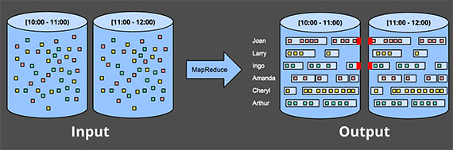
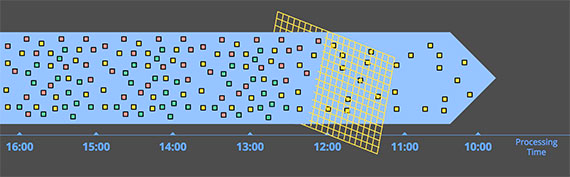
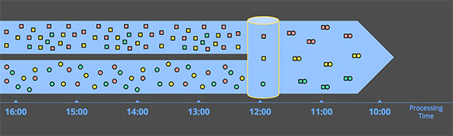
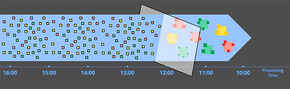
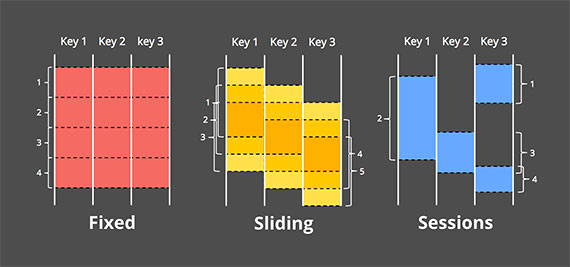
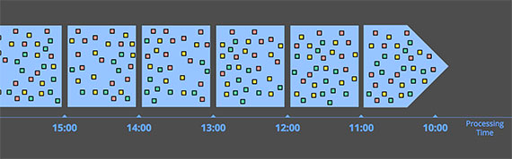
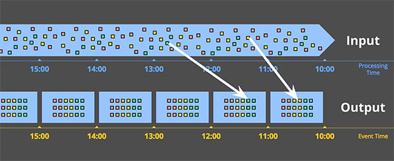
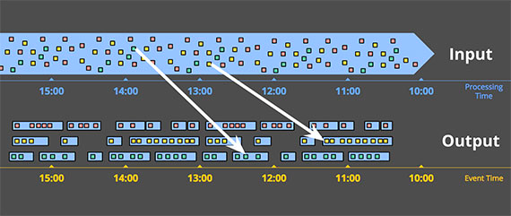

# Streaming 101: The World beyond batch

> Author: Tyler Akidau
>
> 原文链接：https://www.oreilly.com/radar/the-world-beyond-batch-streaming-101/
>
> 
>
> Editor's Note: 这是关于数据处理演变两个系列的第一部分，主要涉及 流式系统，无界数据集(unbounded data sets)，以及大数据的未来。

如今，流式数据处理(Streaming data processing)是大数据领域的一件大事，并且有充分的理由，包括：

- 企业渴望更实时的数据，使用 Streaming Processing 是实现低延迟的一个很好的方式。
- 海量、无边界的数据集在现代商业中越来越普遍，使用专门为这类无止境的数据设计的系统更容易驾驭这些海量数据。
- 在数据到达时就对其进行处理，可以随着时间的推移更均匀地分散工作负载，从而产生更一致和可预测的资源消耗。

尽管这种业务驱动的对"流"的兴趣激增，但是相较于批处理而言，现有的大多数流式系统仍然不成熟，这导致该领域最近出现了许多令人兴奋的积极发展。

作为在 Google 大规模流式系统([Millwheel](http://static.googleusercontent.com/media/research.google.com/zh-CN//pubs/archive/41378.pdf), [Cloud Dataflow](https://cloud.google.com/dataflow/))从事过五年多的从业者，我对当下"流"的时代潮流感到高兴。我也有兴趣确保让人们了解流式系统的所有功能以及如何最好地使用它们，特别是考虑到大多数现有批处理和流式系统之间仍然存在语义差距。由于我有很多内容要介绍，所以我将把它分开两个单独的帖子:

1. Streaming101：第一篇文章将介绍一些基本的背景信息并澄清一些术语，然后再深入了解有关时间域(time domains)的详细信息以及对批处理和流式数据处理常用方法的高级概述。
2. Dataflow 模型：第二篇文章将主要包括 Cloud Dataflow 使用的统一批处理 + 流模型，并通过一个适用于各种用例的具体示例来促进。之后，我将以对现有批处理和流式系统的简要语义比较作为结束。

## 1 背景知识

首先，我将介绍一些重要的背景信息，这些信息将有助于构建我想讨论的其余主题，主要分为三个特定部分：

- 术语：要准确地谈论复杂的话题，需要对术语进行准确的定义。对于那些在当前使用中已经具有过多解释的术语(i.e., 在不同语境下有不同的含义的术语)，我将尽量在提到它们的时候明确我所要表达的意思。
- 功能：我会列举现有流式系统常见的缺点，提出一个我觉得流式系统应该具备的功能，解决现在或者将来数据处理需求。
- 时间域（time domains）：我会引入与数据处理相关的两个主要时间域，分析它们的关系，并指出这两个时间域带来的困难。

### 1.1 术语：什么是流媒体(Streaming)？

在我们深入之前，我想先弄清楚一件事：什么是 streaming ？"Streaming" 这个词现在用来表示各种不同的东西（为了简单起见，到目前为止我都使用的有些随意。i.e., 作者应该想表达 "streaming" 这个词被随意的使用，并没有明确的去定义这个词吧），这可能会导致对Streaming 的真正含义或流式系统实际上是什么产生误解，因此，我更愿意稍微精确地定义这个术语。

问题的症结在于，很多东西应该被描述为他们是什么(比如，无界数据处理(unbounded data processing)和近似结果(approximate results), 等等)，但是实际上他们已经被通俗的描述为以前是如何实现的(即，通过流式计算引擎)。这种缺乏精确性的术语使 Streaming 的真正含义变得模糊，并且在某些情况下，流式系统本身的主题意味着它们的能力仅限于那些常被称为 "Streaming" 的特征(i.e., 流式系统只是有那些被称为 streaming 的特性)，例如近似或推测结果。鉴于精心设计的流式系统与任何现有的批处理引擎一样能够（在技术上更是如此）产生正确、一致、可重复的结果，我更愿意==将术语 Streaming 定性为一个非常具体的含义：一种在设计时考虑到无限数据集的数据处理引擎==。(为了完整起见，值得强调的是，这个定义包括真正的 Streaming 和微批处理(micro-batch)实现。)

至于"Streaming"的其他常见用法，以下是我经常听到的一些用法，每种用法都带有更精确、更具描述性的术语，我建议我们作为一个社区应该尝试采用: 

1. 无界数据(unbounded data)：一种持续产生并且无穷的数据集，通常被称为"流式数据"。但是，用 streaming 和 batch 这两个术语来描述数据集是存在问题的，因为它们只能表示使用某种类型的执行引擎来处理这些数据。实际上，所讨论的两种数据集的主要区别在于它们的有限性。因此，最好用能够捕捉这种区别的术语来描述它们。所以，我将无穷的 "streaming" 数据集称为 *无界数据*，将有限的 "batch" 数据集称为 *有界数据*
2. 无界数据处理(unbounded data processing)：一种持续的数据处理模式，适用于上述类型的无界数据。我自己也喜欢用 streaming 来描述这类数据处理，但在这种情况下使用 streaming 意味着使用 streaming 执行引擎，这简直就是误导；自从首次构思批处理系统以来，批处理引擎的重复运行已被用于处理无界数据（相反，设计良好的流式系统不仅仅是在有界数据上进行批量处理的能力）。因此，为了清楚起见，我将这种数据处理模式称为 *无界数据处理*。
3. 低延迟、近似和推测结果(low-latency, approximate, and/or speculative results)：这些类型的结果常和 streaming 引擎关联在一起。传统上，批处理系统在设计时并未考虑到低延迟或推测结果，这仅仅是历史遗留问题。事实上，批处理引擎是完全能够提供近似结果的。因此，与上面的术语一样，将这些结果描述为它们的本质（低延迟、近似或推测）要比描述它们在历史上的表现方式（通过 streaming 引擎）要好得多。

从现在开始，每次我使用 "streaming" 这个术语时，你都可以直接认为我的意思是为无界数据集设计的执行引擎，仅此而已。而当我提及其他术语时，我会明确地说无界数据、无界数据处理或低延迟/近似/推测结果。这些是我们在 Cloud Dataflow 中采用的术语，我鼓励其他人采取类似的立场。

### 1.2 关于 streaming 被逐渐夸大的局限性

接下来，我们讨论一下流式系统能做什么和不能做什么，重点是能做什么。我想在这些帖子中传达的最大事情之一就是设计良好的 流式系统 的能力。流式系统 长期以来一直被归入一个提供低延迟、近似/推测结果的小众市场，通常与功能更强大的批处理系统结合使用以提供最终正确的结果，即，[Lambda架构](http://nathanmarz.com/blog/how-to-beat-the-cap-theorem.html)。

对于那些还不熟悉 Lambda 架构的人来说，基本思想是在批处理系统旁边运行一个流式系统，两者都执行基本相同的计算。流式系统提供低延迟、不精确的结果(这是因为使用的近似算法，或者系统本身不支持精确性)，之后batch系统开始执行，提供精确的结果。起初是由 Twitter 的 Nathna Marz (Storm的创始人)提出来的，最终非常成功，因为这在当时是个绝妙的想法。当时流引擎在正确性方面有点让人失望，批处理引擎和你想象的一样笨拙，所以 Lambda 给了你一种方法来吃众所周知的蛋糕(i.e., Lambda 架构提供了一种可行的解决方案，并且很受欢迎)。不幸的是，维护 Lambda 系统很麻烦：您需要构建、配置和维护管道的两个独立版本，最后还要以某种方式合并两个管道的结果。

作为一个多年来致力于强一致性流引擎的人，我也发现 Lambda 架构的整个原理有点令人讨厌。不出所料，当 Jay Kreps 的《质疑 Lambda 架构》一文发布时，我就成了他的忠实粉丝。这是反对双模式执行必要性的第一个高度可见的声明之一。Kreps 在使用像 Kafka 这样的可重放系统(replayable system)作为流互连(streaming interconnect)的情况下解决了可重复性问题，甚至提出了 Kappa 架构，这基本上意味着使用设计良好的系统可以为眼前的作业构建合适的单个管道，并运行它。我不认为这个概念本身需要一个名字，但我原则上完全支持这个想法。

老实说，我认为应该更进一步，我认为设计合理的流式系统实际上是提供了严格批处理功能的超集(i.e., 流式系统应该包含了严格的批处理功能)。~~Modulo perhaps an efficiency delta……[^1] (不是很理解作者表达的意思)~~，到那时也许不再需要现在的这种批处理系统。感谢 Flink 的伙计们将这个想法铭记在心，并构建了一个"任何时候都是流"(all-streaming-all-the-time)的系统，即使在"batch"模式下也是如此，我很喜欢它。

所有这一切的必然结果就是，流式系统的成熟，与强大的无界数据处理架构相结合，最终，Lambda架构将会成为大数据的历史。我认为这已经在实现了。实现这个(i.e., 打败批处理)，只需要完成两件事：

1. 正确性(correctness)。使 streaming 与 batch 得到的结果等等同。本质上，正确性归结起来就是一致性存储的问题。流式系统需要一种给状态创建持久化检查点的方法(正如Kreps在文章"[Why local state is a fundamental primitive in stream processing](http://radar.oreilly.com/2014/07/why-local-state-is-a-fundamental-primitive-in-stream-processing.html)"提到的)，它必须设计的足够好，使得即使在机器故障的情况下也能保持(数据的)一致性。早在几年前 Spark Streaming 首次出现时，它就成为了 streaming 领域黑暗时期里保持一致性的灯塔(i.e.，意思是先驱、领头羊)。幸运的是，从那以后保持一致性这件事有所改善，但是仍然有许多流式系统不提供强一致性。我一直不理解为什么 at-most-once 语义处理还存在，但事实是它确实存在。
   再次重申一次，因为这一点很重要：exactly-once 处理需要强一致性，这是正确性所必需的，也是任何系统有机会满足或超过批处理系统能力的要求。除非你真的不关心你的结果，否则我恳请你避开任何不提供强一致性状态的流系统。批处理系统不需要您提前验证它们是否能够产生正确的答案；不要将时间浪费在无法满足相同标准的流式系统上。如果您想了解更多关于如何在流系统中获得强一致性的信息，我建议您查看 MillWheel 和 Spark Streaming 论文，两篇论文都花费了大量时间讨论一致性。鉴于文献和其他地方关于这个主题的质量信息量很大，我不会在这些帖子中进一步介绍它。
2. 时间推理工具(tools for reasoning about time)。使得 streaming 超越 batch。用于推理时间的好工具对于处理不同事件时间偏差的无界、无序数据至关重要。越来越多的现代数据集表现出这些特征，而现有的批处理系统（以及大多数流系统）缺乏必要的工具来应对它们(无界、无序)带来的困难。我将用这篇文章的剩余部分和下一篇文章的大部分内容来重点解释这一点。首先，我们将对时间域的重要概念有一个基本的了解，然后我们将更深入地了解我所说的具有不同事件时间偏差的无界、无序数据的含义。然后，我们将在这篇文章的其余部分研究使用批处理和流式系统进行有界和无界数据处理的常用方法。

### 1.3 事件时间 vs. 处理时间

要令人信服地谈论无界数据处理，需要清楚地了解所涉及的时间域。在任何数据处理系统中，我们通常关心两个时间域：

- 事件时间(event time)，也就是事件真正发生的时间。
- 处理时间(processing time)，也就是事件被系统获知的时时间(i.e., 可以理解为事件进入系统的时间，大部分是被应用层接收到之后附加的时间戳)

不是所有的应用场景都考虑事件时间(如果你的用例不关心，万岁！——你的生活更轻松了), 但很多都是关注的。比如包括随时间赋予用户行为特色、大多数计费应用程序和许多类型的异常检测等等。

在理想情况下，事件时间和处理时间总是相等的，事件发生时立即处理。然而，现实并非如此，事件时间和处理时间之间的偏差不仅非零，而且通常是底层输入源、执行引擎和硬件特征的高度可变函数。可能影响偏斜程度的因素包括：

- 共享资源限制，例如网络拥塞、网络分区或非专用环境中的共享 CPU
- 软件因素，比如分布式系统逻辑、冲突等
- 数据特性本身的特征，包括key的分布、吞吐变化、无序变化(例如，一架满载乘客的飞机在整个飞行过程中离线使用手机后将手机退出飞行模式）

因此，如果您在任何实际系统中绘制事件时间和处理时间的进度，您通常会得到一些看起来有点像图 1 中的红线的东西。

> *图 1: 时间域映射示例。*X 轴表示系统中的事件时间完整性，即事件时间中的时间 X，直到所有事件时间小于 X 的数据都已被观察到。 Y 轴表示处理时间的进度，即数据处理系统在执行时观察到的正常时钟时间。图片来源：*Tyler Akidau*。

黑色虚线代表理想情况，即事件时间和处理时间完全一致；红色实线表示现实情况。在这个例子中，系统在处理时间开始时有点滞后，在中间更接近理想，然后在接近结束时再次滞后。理想和红线之间的水平距离是处理时间和事件时间之间的偏差。这种偏差本质上是处理管道引入的延迟(~~i.e., 可以理解为处理管道摄入数据的延迟吧~~)。

由于事件时间和处理时间之间的映射不是静态的，这意味着如果您关心数据的事件时间（即事件实际发生的时间），则不能仅在管道中观察到数据的时间范围内分析数据。不幸的是，这是大多数现有的处理无界数据系统的运行方式。了应对无界数据集的无限特性，这些系统通常提供一些对输入数据进行窗口化的概念。我们将在下面深入讨论窗口化，但它本质上意味着将数据集沿时间边界分割成有限的片段。

如果您关心正确性并有兴趣在事件时间的上下文中分析您的数据，则无法像大多数现有系统那样使用处理时间（即处理时间窗口）来定义这些时间边界;由于处理时间和事件时间之间没有一致的相关性，您的一些事件时间数据最终会出现在错误的处理时间窗口中(由于分布式系统中的固有滞后，许多类型的输入源的在线/离线性质等等导致的)，就像把正确性扔到了窗外。我们将在下面的一些示例以及下一篇文章中更详细地研究这个问题。

不幸的是，当按事件时间窗口时，情况也不完全乐观。在无界数据的情况下，无序和变量偏斜会导致事件时间窗口的完整性问题：在处理时间和事件时间之间缺乏可预测的映射，您如何确定何时观察到给定事件时间 X 的所有数据？对许多现实世界的数据源来说，您根本做不到。当今使用的绝大多数数据处理系统都依赖于某种完整性概念，这使它们在应用于无界数据集时处于严重劣势。

我建议，与其尝试将无限数据整理成最终变得完整的有限批次信息，不如设计工具让我们能够生活在这些复杂数据集所带来的不确定性世界中。新数据会到来，旧数据可能会被收回或更新，我们构建的任何系统都应该能够自行处理这些事实，完整性的概念是一种方便的优化，而不是语义上的必要性。

在深入探讨我们如何尝试使用 Cloud Dataflow 中使用的 Dataflow 模型构建这样一个系统之前，让我们完成一个更有用的背景知识：常见的数据处理模式。

## 2 数据处理模式

此时，我们已经建立了足够的背景，我们可以开始研究当今有界和无界数据处理中常见的核心使用模式类型。我们将在我们关心的两种主要引擎类型(batch and streaming)的背景下研究这两种类型的处理(在这种情况下，我基本上将微批处理与流式处理混为一谈，因为两者之间的差异在这个级别上并不是非常重要)。

## 2.1 有穷数据

处理有界数据非常简单，可能每个人都熟悉。在下图中，我们从左边的一个充满熵的数据集开始。我们通过一些数据处理引擎（通常是批处理，尽管设计良好的流引擎也可以工作）运行它，例如 [MapReduce](http://static.googleusercontent.com/media/research.google.com/zh-CN//archive/mapreduce-osdi04.pdf)，并在右侧最终得到一个具有更大内在价值的新结构化数据集：

> *图 2: 使用经典批处理引擎进行有界数据处理。*左侧的有限非结构化数据池通过数据处理引擎运行，从而在右侧产生相应的结构化数据。图片来源：*Tyler Akidau*。

当然，作为该方案的一部分，您实际计算的内容可以有无限的变化，但整体模型非常简单。更有趣的是处理无界数据集的任务。现在让我们看看通常处理无界数据的各种方式，从传统批处理引擎使用的方法开始，然后介绍为无界数据设计的系统可以采用的方法，例如大多数流式或微批处理引擎。

### 2.2 无界数据 — 批

batch执行引擎尽管不是为了处理无穷数据而设计的，也能用来处理无穷数据，从一开始就被业界使用了。正如大家所预料的，这类方法基本是将无穷数据划分为有穷数据的集合，而有穷数据集是适合用batch系统处理的。

#### 2.2.1 Fixed Windows(固定窗口)

使用批处理引擎重复运行来处理无界数据集的最常见方法是将输入数据窗口化到固定大小的窗口中，然后将这些窗口中的每一个作为单独的有界数据源进行处理。特别是对于像日志这样的输入源，其中事件可以写入目录和文件层次结构，其名称编码它们对应的窗口，这种事情乍一看似乎很简单，因为您实际上已经执行了基于时间的随机播放来获取数据提前进入适当的事件时间窗口。

然而，实际上，大多数系统仍然存在完整性问题需要处理：如果您的某些事件在发送到日志的途中由于网络分区而延迟怎么办？如果您的事件是在全球范围内收集的，并且必须在处理之前转移到一个公共位置怎么办？如果您的活动来自移动设备怎么办？这意味着可能需要采取某种缓解措施(例如，延迟处理直到您确定所有事件都已收集，或者每当数据延迟到达时重新处理给定窗口的整个批次)。

> *图 3: 通过经典批处理引擎的临时固定窗口进行无界数据处理。*一个无界数据集被预先收集到有限的、固定大小的有界数据窗口中，然后通过经典批处理引擎的连续运行进行处理。图片来源：*Tyler Akidau*

#### 2.2.2 Sessions

当您尝试使用批处理引擎将无界数据处理到更复杂的窗口策略（如 session）时，这种方法会更加失败。session 通常被定义为 periods of activity (e.g., for a specific user) terminated by a gap of inactivity.~~(是在不好翻译这话，不过 session 就是一种持久网络协议，连线阶段或工作阶段的一个短暂窗口)~~。使用典型的批处理引擎计算 session 时，您通常会得到跨批次拆分的 session，如下图中的红色标记所示。可以通过增加批量大小来减少拆分的数量，但代价是延迟增加。另一种选择是添加额外的逻辑来拼接以前运行的 session，但代价是增加了复杂性。

> *图 4: 通过经典批处理引擎的临时固定窗口将无限数据处理到 session 中。*一个无界数据集被预先收集到有限的、固定大小的有界数据窗口中，然后通过连续运行经典批处理引擎将其细分为动态 session 窗口。图片来源：*Tyler Akidau*

无论哪种方式，使用经典的批处理引擎来计算 session 都不太理想。一个更好的方法是以流的方式建立会话，我们稍后会看到。

## 2.3 无界数据 — 流

与大多数基于批处理的无界数据处理方法的特殊性质相反，流系统是为无界数据构建的。正如我之前提到的，对于许多现实世界的分布式输入源，您不仅会发现自己在处理无界数据，而且数据还包括：

- 在事件时间方面高度乱序，这意味着如果您想在数据发生的上下文中分析数据，您需要在管道中进行某种基于时间的 shuffle。
- 不同的事件时间的偏差，这意味着您不能只是假设您总是会在时间 Y 的某个恒定 ε 区间内看到给定事件时间 X 的大部分数据。

在处理具有这些特征的数据时，可以采取多种方法。我通常将这些方法分为四组：

- 与时间无关的
- 近似算法
- 基于处理时间的窗口
- 基于事件时间的窗口

接下来一一讨论以上这四类方法。

### 2.3.1 与时间无关 Time-Agnostic

与时间无关的处理用于时间本质上不相关的情况 —— 即所有相关逻辑都是数据驱动的。由于有关此类用例的所有内容都取决于更多数据的到达，因此流引擎实际上没有什么特别需要支持的，除了基本的数据交付。因此，基本上所有现有的流系统都支持开箱即用的时间无关用例（当然，对于那些关心正确性的人来说，modulo system-to-system variances in consistency guarantees ~~您到底想说什么😫😫，我真的不理解呀！😣难道是一致性保证中系统间的差异?~~）。批处理系统也非常适合与时间无关的无界数据源处理，只需将无界数据源切成任意序列的有界数据集并独立处理这些数据集。我们将在本节中查看几个具体示例，但考虑到处理与时间无关的处理的直接性，除此之外不会花太多时间在它上面。

#### Filtering (过滤)

一种非常基本的与时间无关的处理形式是 Filtering。假设您正在处理 Web 流量日志，并且您想要过滤掉所有并非来自特定域的流量。您会在每条记录到达时查看它，看看它是否属于感兴趣的域，如果不属于则删除它。由于这类事情在任何时候都只依赖于单个元素，因此数据源是无界的、无序的以及不同的事件时间偏差这一事实是无关紧要的。

> *图 5: 过滤无界数据。*不同类型的数据集合（从左到右流动）被过滤成包含单一类型的同质集合。图片来源：*Tyler Akidau*

#### Inner-Joins (内连接)

另一个与时间无关的示例是 Inner-Join (又叫 Hash-Join)。当 join 两个无界数据源时，如果您只关心来自两个数据源的元素到达时的 join 结果，那么逻辑中就没有时间元素。从一个来源看到一个值后，您可以简单地将其缓冲为持久状态；一旦来自另一个来源的第二个值到达，您只需要发出 join 的记录。(实际上，您可能需要某种针对未发出的部分连接的垃圾收集策略，这可能是基于时间的。但对于很少或没有未完成连接的用例，这样的事情可能不是问题。)

> *图 6: 对无界数据执行 Inner-Join。*当观察到来自两个来源的匹配元素时产生 join。图片来源：*Tyler Akidau*

当语义切换到某种外连接就引入了我们已经讨论过的数据完整性问题：一旦你看到了 join 一侧(的数据)，你怎么知道另一侧(的数据)是否会到达？说实话，你不知道，所以你必须引入一些==超时==的概念，这就引入了一个时间元素。时间元素本质上是一种窗口形式，我们稍后会更仔细地研究它。

### 2.3.2 近似算法 Approximation algorithms

> *图 7: 计算无界数据的近似值。*数据通过复杂的算法运行，产生的输出数据看起来或多或少像另一边的预期结果。图片来源：*Tyler Akidau*

第二类主要方法是近似算法，例如[近似 Top-N](https://pkghosh.wordpress.com/2014/09/10/realtime-trending-analysis-with-approximate-algorithms/)、[流式 K-means](https://databricks.com/blog/2015/01/28/introducing-streaming-k-means-in-spark-1-2.html) 等。它们采用无限制的输入源并提供输出数据，如果你眯着眼睛看(~~应该是想表达，如果对数据的结果正确性要求不高~~)，它们或多或少看起来像你希望得到。近似算法的优势在于，通过设计，它们的开销很低，并且专为无限数据而设计。缺点是它们的集合有限，算法本身通常很复杂（这使得很难想出新的算法），并且它们的近似性质限制了它们的实用性。

值得注意的是：些算法通常在其设计中确实包含一些时间元素(例如：一些内置的衰变因子)。而且由于它们在元素到达时对其进行处理，因此该时间元素通常是基于处理时间的。这对于在其近似值上提供某种可证明的误差范围的算法尤其重要。如果这些错误界限是基于按顺序到达的数据，那么当您向算法提供具有不同事件时间偏差的无序数据时，它们基本上没有任何意义。

近似算法本身是一个引人入胜的主题，但由于它们本质上是与时间无关的处理的另一个例子（以算法本身的时间特征为模），它们使用起来非常简单，因此鉴于我们目前的关注点，不值得进一步关注。

### 2.3.3 窗口

剩下的两种无界数据处理方法都是开窗的变体。在深入探讨它们之间的差异之前，我应该明确我所说的窗口是什么意思，因为我只是简单地谈到了它。窗口化只是获取数据源（无界或有界）并将其沿时间边界分割成有限块进行处理的简单概念。下图显示了三种不同的窗口模式：

> *图 8: 窗口策略。*每个示例针对三个不同的键显示，突出显示对齐窗口（适用于所有数据）和未对齐窗口（适用于数据子集）之间的差异。图片来源：*Tyler Akidau*

- 固定窗口(Fixed Windows)，固定窗口将时间分割成具有固定大小时间长度的片段。通常(如图 8 中)，固定窗口的段统一应用于整个数据集，这是对齐窗口的一个示例。在某些情况下，需要为不同的数据子集（例如，每个key）对窗口进行相移，以便随着时间的推移更均匀地分布窗口完成负载，这反而是未对齐窗口的一个示例，因为它们在数据中有所不同。
- 滑动窗口(Sliding Windows)，是固定窗口的一种泛化，滑动窗口由固定长度和固定周期定义。如果周期小于长度，则窗口重叠。如果周期等于长度，则您有固定的窗口。如果周期大于长度，你就会有一种奇怪的采样窗口，它只会随着时间的推移查看数据的子集。与固定窗口一样，滑动窗口通常是对齐的，尽管在某些用例中作为性能优化可能不对齐。请注意，图 8 中的滑动窗口是按原样绘制的，以提供滑动运动的感觉；实际上，所有五个窗口都将应用于整个数据集。
- 会话(Sessions)，动态窗口的一个示例，会话由一系列事件组成，这些事件由大于某个超时时间的不活动间隔终止(~~大于某个超时时间不活跃之后，session 窗口关闭~~)。session 通常用于通过将一系列与时间相关的事件（例如，一次观看的一系列视频）组合在一起来分析用户随时间的行为。session 很有趣，因为它们的长度不能先提前定义；它们取决于所涉及的实际数据。它们也是未对齐窗口的典型示例，因为会话在不同的数据子集（例如，不同的用户）之间实际上永远不会相同。

讨论的两个时间域 —— 处理时间和事件时间 —— 本质上也是我们关心的两个[^2]。窗口化在这两个领域都有意义，因此我们将详细研究每个领域，看看它们有何不同。由于处理时间窗口在现有系统中更为常见，我将从那里开始。

#### 基于处理时间的窗口

> *图 9: 按处理时间窗口化到固定窗口。*数据根据它们到达管道的顺序收集到窗口中。图片来源：*Tyler Akidau*

当按处理时间开窗时，系统基本上将传入的数据缓冲到窗口中，直到经过一定量的处理时间。例如，在五分钟固定窗口的情况下，系统会将数据缓冲五分钟的处理时间，然后将在这五分钟内观察到的所有数据视为一个窗口，并将它们发送到下游进行处理。

处理时间窗口有一些很好的特性：

- ==简单==，实现非常简单，因为您永远不必担心根据时间进行数据 shuffling。您只需在它们到达时缓冲它们并在窗口关闭时将它们发送到下游。
- ==判断窗口完整性很简单==，由于系统完全了解窗口的所有输入是否已被看到，它可以完美地决定给定窗口是否完整。这意味着在按处理时间开窗时，无需以任何方式处理“迟到”的数据。
- 如果您想==在观察到的情况下推断有关源的信息==，处理时间窗口正是您想要的。许多监控场景都属于这一类。想象一下，跟踪每秒发送到全球规模 Web 服务的请求数。计算这些请求的速率以检测中断是处理时间窗口的完美使用场景。

除了优点之外，处理时间窗口还有一个很大的==缺点==：*如果所讨论的数据具有与之关联的事件时间，那么如果处理时间窗口要反映这些事件实际发生的时间，那么这些数据必须按事件时间顺序到达。*不幸的是，事件时间有序数据在许多现实世界的分布式输入源中并不常见。

举个简单的例子，想象一下任何收集使用统计信息以供以后处理的移动应用程序。如果给定的移动设备在任何时间内离线（短暂的连接中断、飞越全国时的飞行模式等），在此期间记录的数据将在设备再次上线之前不会上传。这意味着数据到达时可能会出现几分钟、几小时、几天、几周或更长时间的事件时间偏差。当以处理时间为窗口时，基本上不可能从这样的数据集中得出任何有用的推论。

再举个例子，当整个系统健康时，许多分布式输入源似乎提供事件时间排序（或非常接近）数据。不幸的是，输入源在健康时的事件时间偏差很低这一事实并不意味着它会一直保持这种状态。考虑一个处理在多个大洲收集的数据的全球服务。如果带宽受限的横贯大陆线路上的网络问题（令人遗憾的是，这种情况非常普遍）进一步降低了带宽和/或增加了延迟，那么您的输入数据的一部分可能突然开始以比以前更大的偏差到达。如果您按处理时间对数据进行窗口化，则您的窗口不再代表其中实际发生的数据；相反，它们代表事件到达处理管道时的时间窗口，这是旧数据和当前数据的任意混合。

在这两种情况下，我们真正想要的是通过事件时间以对事件到达顺序稳健的方式对数据进行窗口化。我们真正想要的是事件时间窗口。

#### 基于事件时间的窗口

当您需要以反映这些事件实际发生的时间的有限区间中观察数据源时，您可以使用事件时间窗口。这是开窗的黄金标准。遗憾的是，当今使用的大多数数据处理系统都缺乏对它的原生支持（尽管任何具有良好一致性模型的系统，如 Hadoop 或 Spark Streaming，都可以作为构建此类窗口系统的合理基础）。

此图显示了将无界源窗口化为一小时固定窗口的示例：

> *图 10: 按事件时间窗口化到固定窗口。*数据根据它们发生的时间收集到窗口中。白色箭头标出到达处理时间窗口的示例数据，这些时间窗口不同于它们所属的事件时间窗口。图片来源：*Tyler Akidau*

图中的实白线标出了两个感兴趣的特定数据。这两个数据都到达了与它们所属的事件时间窗口不匹配的处理时间窗口。因此，如果将这些数据窗口化为关心事件时间的用例的处理时间窗口，则计算结果将不正确。正如人们所期望的那样，事件时间正确性是使用事件时间窗口的一件好事。

无界数据源上的事件时间窗口化的另一个好处是，您可以创建动态大小的窗口，例如 session，而不会在固定窗口上生成会话时观察到任意拆分（正如我们之前在"无界数据 - 批"部分的 session 示例中看到的那样）

> *图 11: 按事件时间窗口化到会话窗口。*根据相应事件发生的时间，将数据收集到捕获活动突发的会话窗口中。白色箭头再次指出了 调用必要的temproal shuffle将数据放入正确的事件时间位置。图片来源：*Tyler Akidau*

当然，~~强大的语义很少是免费提供的(powerful semantics rarely conme for free，i.e., 强大的语义也并非无所不能？应该差不多这意思吧)~~，事件时间窗口也不例外。事件时间窗口有两个显著的缺点，因为(在处理时间内)窗口通常必须比窗口本身的实际长度更长的存活时间：

- 缓存：由于延长了窗口的生命周期，需要缓冲更多的数据。值得庆幸的是，持久存储通常是大多数数据处理系统所依赖的资源类型中最便宜的(其他资源类型主要是 CPU、网络带宽和 RAM)，因此，当使用任何设计良好、具有强一致性持久状态和体面的内存缓存层的数据处理系统时，这个问题通常比人们想象的要少得多。此外，许多有用的聚合不需要缓冲整个输入集（例如求和或平均），而是可以增量执行，将更小的中间聚合存储在持久状态中。
- 完整性：鉴于我们通常无法知道何时可以看到给定窗口的所有数据，以及我们如何知道窗口内的结果何时 ready to materialize(~~准备好进行物化？应该是可以进行计算的意思吧~~)？事实上，我们根本无法知道。对于许多类型的输入，系统可以通过类似于 MillWheel 的 Watermarks（我将在第 2 部分中详细讨论）等方式给出窗口完成的相当准确的启发式估计。但是在绝对正确性至关重要的情况下(比如，计费)，唯一真正的选择是为管道构建者提供一种方式，让他们表达他们何时希望实现窗口的结果，以及随着时间的推移应该如何改进这些结果。处理窗口完整性（或缺失）是一个引人入胜的话题，但最好在具体示例的背景下进行探索，我们将在下一次讨论。

## 3 总结

哇！这篇文章包含了很多信息，对于那些已经读到这的人：你应该受到赞扬！到这里上，我们已经大致完成了我想要介绍的内容，所以退后一步，回顾一下我到目前为止所介绍的内容，让事情在进入第 2 部分之前稍作调整可能是合理的。所有这一切的好处是第 1 部分是无聊的帖子；第 2 部分是乐趣真正开始的地方。

#### 回顾

总而言之，在这篇文章中，我做了(以下事情)：

- 澄清术语，特别将=="流"==的定义缩小到==仅适用于执行引擎==，同时对通常归类在"流"范畴下的不同概念使用更具描述性的术语，如，==无界数据==和==近似/推测结果==，
- 评估了精心设计的批处理和流系统的相关能力，提出了==流实际上是批处理的严格超集==，并且认为像 Lambda 架构(即以流式处理不如批处理为前提的架构)注定会随着流式系统的成熟而被取代。
- 提出了流系统赶上并最终超越批处理所必需的两个高级概念，它们分别是==正确性==和==时间推理工具==
- 确定了==事件时间和处理时间之间的重要差异==，描述了这些差异在分析数据时所带来的困难，并提出了一种从完整性概念和简单地适应到数据随时间的变化的转变。
- 通过批处理和流引擎看当今常用的有界和无界数据的主要数据处理方法，将无界的处理方法大致分为：==time-agnostic==, ==approximation==, ==windowing by processing time==, ==windowing by event time==。

#### 下一次

这篇文章为我将在第 2 部分中探讨的具体示例提供了必要的上下文。那篇文章将大致包括以下内容：

- 从概念上看我们如何在四个相关轴上分解数据流模型中的数据处理概念：what, where, when, how。
- 详细了解如何处理跨多个场景的简单的、具体的示例数据集，突出数据流模型(Dataflow Model)支持的多个用例以及所涉及的具体 API。这些示例将有助于深入理解本文中介绍的事件时间和处理时间的概念，同时探索新的概念，例如，Watermarks
- 比较两个帖子中涵盖的重要特征的现有数据处理系统(batch system 和 streaming system)，以便更好地在它们之间做出有根据的选择，并鼓励改进缺乏的领域，我的最终目标是总体上改进数据处理系统，特别是流媒体系统，横跨整个大数据社区。

----

*注：*

[^1]: 我提出的一个不是流式系统的固有限制，而仅仅是迄今为止在大多数流式系统中所做的设计选择的结果。批处理和流式传输之间的 efficiency delta (~~效率差异?~~)很大程度上是批处理系统中增加的捆绑和更有效的随机传输的结果。现代批处理系统不遗余力地实现复杂的优化，允许使用惊人的适度计算资源实现显着水平的吞吐量。这种理智的见解没有理由不使无法被整合到为无界数据设计的系统的批处理系统成为高效的重量级人物，并为用户在我们通常认为的高延迟、高效率的"批处理"和低延迟、低效率的"流式"处理之间提供灵活的选择。通过在相同的统一模型下提供高效的批处理 runner 和流式 runner，这实际上就是我们在 Cloud Dataflow 做的。但在我们的案例中，我们使用单独的 runner，因为我们碰巧有两个针对特定用例进行了优化的独立设计的系统。从工程的角度以及长远来看，我希望看到我们将两者合并为一个系统，该系统结合了两者的最佳部分，同时仍保持选择适当效率水平的灵活性，但这不是我们如今所拥有的。老实说，多亏了统一的数据流模型，这甚至不是绝对必要的，但是没有它，我所希望的很可能永远不会发生
[^2]: 如果你在学术文献或基于 SQL 的流式系统中研究得足够多，你还会遇到第三个窗口时域：基于元组的窗口（即，大小以元素数量计的窗口）。然而，基于元组的窗口本质上是一种处理时间窗口形式，其中元素在到达系统时被分配单调递增的时间戳。因此，我们不会在这里详细讨论基于元组的窗口化（尽管我们将在第 2 部分中看到一个示例）