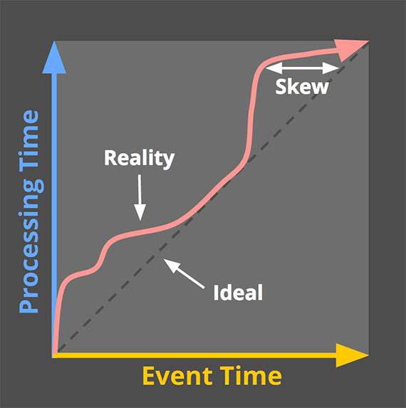
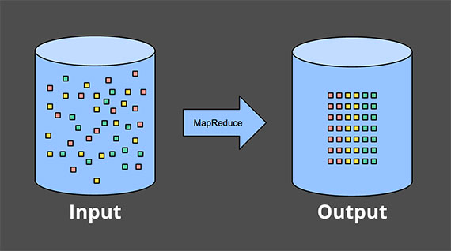
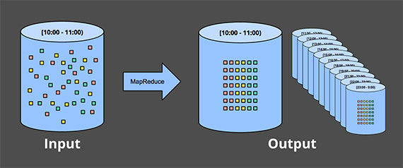

> Editor's Note: 这是关于数据处理演变两个系列的第一部分，主要涉及 流式系统，无界数据集(unbounded data sets)，以及大数据的未来。

如今，流式数据处理(Streaming data processing)是大数据领域的一件大事，并且有充分的理由，包括：

- 企业渴望更实时的数据，使用 Streaming Processing 是实现低延迟的一个很好的方式。
- 海量、无边界的数据集在现代商业中越来越普遍，使用专门为这类无止境的数据设计的系统更容易驾驭这些海量数据。
- 在数据到达时就对其进行处理，可以随着时间的推移更均匀地分散工作负载，从而产生更一致和可预测的资源消耗。

尽管这种业务驱动的对"流"的兴趣激增，但是相较于批处理而言，现有的大多数流式系统仍然不成熟，这导致该领域最近出现了许多令人兴奋的积极发展。

作为在 Google 大规模流式系统(Millwheel, Cloud Dataflow)从事过五年多的从业者，我对当下"流"的时代潮流感到高兴。我也有兴趣确保让人们了解流式系统的所有功能以及如何最好地使用它们，特别是考虑到大多数现有批处理和流式系统之间仍然存在语义差距。由于我有很多内容要介绍，所以我将把它分开两个单独的帖子:

1. Streaming101：第一篇文章将介绍一些基本的背景信息并澄清一些术语，然后再深入了解有关时间域(time domains)的详细信息以及对批处理和流式数据处理常用方法的高级概述。
2. Dataflow 模型：第二篇文章将主要包括 Cloud Dataflow 使用的统一批处理 + 流模型，并通过一个适用于各种用例的具体示例来促进。之后，我将以对现有批处理和流式系统的简要语义比较作为结束。

## 1 背景知识

首先，我将介绍一些重要的背景信息，这些信息将有助于构建我想讨论的其余主题，主要分为三个特定部分：

- 术语：要准确地谈论复杂的话题，需要对术语进行准确的定义。对于那些在当前使用中已经具有过多解释的术语(i.e., 在不同语境下有不同的含义的术语)，我将尽量在提到它们的时候明确我所要表达的意思。
- 功能：我会列举现有流式系统常见的缺点，提出一个我觉得流式系统应该具备的功能，解决现在或者将来数据处理需求。
- 时间域（time domains）：我会引入与数据处理相关的两个主要时间域，分析它们的关系，并指出这两个时间域带来的困难。

### 1.1 术语：什么是流媒体(Streaming)？

在我们深入之前，我想先弄清楚一件事：什么是 streaming ？"Streaming" 这个词现在用来表示各种不同的东西（为了简单起见，到目前为止我都使用的有些随意。i.e., 作者应该想表达 "streaming" 这个词被随意的使用，并没有明确的去定义这个词吧），这可能会导致对Streaming 的真正含义或流式系统实际上是什么产生误解，因此，我更愿意稍微精确地定义这个术语。

问题的症结在于，很多东西应该被描述为他们是什么(比如，无界数据处理(unbounded data processing)和近似结果(approximate results), 等等)，但是实际上他们已经被通俗的描述为以前是如何实现的(即，通过流式计算引擎)。这种缺乏精确性的术语使 Streaming 的真正含义变得模糊，并且在某些情况下，流式系统本身的主题意味着它们的能力仅限于那些常被称为 "Streaming" 的特征(i.e., 流式系统只是有那些被称为 streaming 的特性)，例如近似或推测结果。鉴于精心设计的流式系统与任何现有的批处理引擎一样能够（在技术上更是如此）产生正确、一致、可重复的结果，我更愿意==将术语 Streaming 定性为一个非常具体的含义：一种在设计时考虑到无限数据集的数据处理引擎==。(为了完整起见，值得强调的是，这个定义包括真正的 Streaming 和微批处理(micro-batch)实现。)

至于"Streaming"的其他常见用法，以下是我经常听到的一些用法，每种用法都带有更精确、更具描述性的术语，我建议我们作为一个社区应该尝试采用: 

1. 无界数据(unbounded data)：一种持续产生并且无穷的数据集，通常被称为"流式数据"。但是，用 streaming 和 batch 这两个术语来描述数据集是存在问题的，因为它们只能表示使用某种类型的执行引擎来处理这些数据。实际上，所讨论的两种数据集的主要区别在于它们的有限性。因此，最好用能够捕捉这种区别的术语来描述它们。所以，我将无穷的 "streaming" 数据集称为 *无界数据*，将有限的 "batch" 数据集称为 *有界数据*
2. 无界数据处理(unbounded data processing)：一种持续的数据处理模式，适用于上述类型的无界数据。我自己也喜欢用 streaming 来描述这类数据处理，但在这种情况下使用 streaming 意味着使用 streaming 执行引擎，这简直就是误导；自从首次构思批处理系统以来，批处理引擎的重复运行已被用于处理无界数据（相反，设计良好的流式系统不仅仅是在有界数据上进行批量处理的能力）。因此，为了清楚起见，我将这种数据处理模式称为 *无界数据处理*。
3. 低延迟、近似和推测结果(low-latency, approximate, and/or speculative results)：这些类型的结果常和 streaming 引擎关联在一起。传统上，批处理系统在设计时并未考虑到低延迟或推测结果，这仅仅是历史遗留问题。事实上，批处理引擎是完全能够提供近似结果的。因此，与上面的术语一样，将这些结果描述为它们的本质（低延迟、近似或推测）要比描述它们在历史上的表现方式（通过 streaming 引擎）要好得多。

从现在开始，每次我使用 "streaming" 这个术语时，你都可以直接认为我的意思是为无界数据集设计的执行引擎，仅此而已。而当我提及其他术语时，我会明确地说无界数据、无界数据处理或低延迟/近似/推测结果。这些是我们在 Cloud Dataflow 中采用的术语，我鼓励其他人采取类似的立场。

### 1.2 关于 streaming 被逐渐夸大的局限性

接下来，我们讨论一下流式系统能做什么和不能做什么，重点是能做什么。我想在这些帖子中传达的最大事情之一就是设计良好的 流式系统 的能力。流式系统 长期以来一直被归入一个提供低延迟、近似/推测结果的小众市场，通常与功能更强大的批处理系统结合使用以提供最终正确的结果，即，Lambda架构。

对于那些还不熟悉 Lambda 架构的人来说，基本思想是在批处理系统旁边运行一个流式系统，两者都执行基本相同的计算。流式系统提供低延迟、不精确的结果(这是因为使用的近似算法，或者系统本身不支持精确性)，之后batch系统开始执行，提供精确的结果。起初是由 Twitter 的 Nathna Marz (Storm的创始人)提出来的，最终非常成功，因为这在当时是个绝妙的想法。当时流引擎在正确性方面有点让人失望，批处理引擎和你想象的一样笨拙，所以 Lambda 给了你一种方法来吃众所周知的蛋糕(i.e., Lambda架构提供了一种可行的解决方案，并且很受欢迎)。不幸的是，维护 Lambda 系统很麻烦：您需要构建、配置和维护管道的两个独立版本，最后还要以某种方式合并两个管道的结果。

作为一个多年来致力于强一致性流引擎的人，我也发现 Lambda 架构的整个原理有点令人讨厌。不出所料，当 Jay Kreps 的《质疑 Lambda 架构》一文发布时，我就成了他的忠实粉丝。这是反对双模式执行必要性的第一个高度可见的声明之一。Kreps 在使用像 Kafka 这样的可重放系统(replayable system)作为流互连(streaming interconnect)的情况下解决了可重复性问题，甚至提出了 Kappa 架构，这基本上意味着使用设计良好的系统可以为眼前的作业构建合适的单个管道，并运行它。我不认为这个概念本身需要一个名字，但我原则上完全支持这个想法。

老实说，我认为应该更进一步，我认为设计合理的流式系统实际上是提供了严格批处理功能的超集(i.e., 流式系统应该包含了严格的批处理功能)。~~Modulo(同余理论)可能是个efficiency delta(不是很理解作者表达的意思)~~，到那时也许不再需要现在的这种批处理系统。感谢 Flink 的伙计们将这个想法铭记在心，并构建了一个"任何时候都是流"(all-streaming-all-the-time)的系统，即使在"batch"模式下也是如此，我很喜欢它。

所有这一切的必然结果就是，流式系统的成熟，与强大的无界数据处理架构相结合，最终，Lambda架构将会成为大数据的历史。我认为这已经在实现了。实现这个(i.e., 打败批处理)，只需要完成两件事：

1. 正确性(correctness)。使 streaming 与 batch 得到的结果等等同。本质上，正确性归结起来就是一致性存储的问题。流式系统需要一种给状态创建持久化检查点的方法(正如Kreps在文章"[Why local state is a fundamental primitive in stream processing](http://radar.oreilly.com/2014/07/why-local-state-is-a-fundamental-primitive-in-stream-processing.html)"提到的)，它必须设计的足够好，使得即使在机器故障的情况下也能保持(数据的)一致性。早在几年前 Spark Streaming 首次出现时，它就成为了 streaming 领域黑暗时期里保持一致性的灯塔(i.e.，意思是先驱、领头羊)。幸运的是，从那以后保持一致性这件事有所改善，但是仍然有许多流式系统不提供强一致性。我一直不理解为什么 at-most-once 语义处理还存在，但事实是它确实存在。
   再次重申一次，因为这一点很重要：exactly-once 处理需要强一致性，这是正确性所必需的，也是任何系统有机会满足或超过批处理系统能力的要求。除非你真的不关心你的结果，否则我恳请你避开任何不提供强一致性状态的流系统。批处理系统不需要您提前验证它们是否能够产生正确的答案；不要将时间浪费在无法满足相同标准的流式系统上。如果您想了解更多关于如何在流系统中获得强一致性的信息，我建议您查看 MillWheel 和 Spark Streaming 论文，两篇论文都花费了大量时间讨论一致性。鉴于文献和其他地方关于这个主题的质量信息量很大，我不会在这些帖子中进一步介绍它。
2. 时间推理工具(tools for reasoning about time)。使得 streaming 超越 batch。用于推理时间的好工具对于处理不同事件时间偏差的无界、无序数据至关重要。越来越多的现代数据集表现出这些特征，而现有的批处理系统（以及大多数流系统）缺乏必要的工具来应对它们(无界、无序)带来的困难。我将用这篇文章的剩余部分和下一篇文章的大部分内容来重点解释这一点。首先，我们将对时间域的重要概念有一个基本的了解，然后我们将更深入地了解我所说的具有不同事件时间偏差的无界、无序数据的含义。然后，我们将在这篇文章的其余部分研究使用批处理和流式系统进行有界和无界数据处理的常用方法。

### 1.3 事件时间 vs. 处理时间

要令人信服地谈论无界数据处理，需要清楚地了解所涉及的时间域。在任何数据处理系统中，我们通常关心两个时间域：

- 事件时间(event time)，也就是事件真正发生的时间。
- 处理时间(processing time)，也就是事件被系统获知的时时间(i.e., 可以理解为事件进入系统的时间，大部分是被应用层接收到之后附加的时间戳)

不是所有的应用场景都考虑事件时间(如果你的用例不关心，万岁！——你的生活更轻松了), 但很多都是关注的。比如包括随时间赋予用户行为特色、大多数计费应用程序和许多类型的异常检测等等。

在理想情况下，事件时间和处理时间总是相等的，事件发生时立即处理。然而，现实并非如此，事件时间和处理时间之间的偏差不仅非零，而且通常是底层输入源、执行引擎和硬件特征的高度可变函数。可能影响偏斜程度的因素包括：

- 共享资源限制，例如网络拥塞、网络分区或非专用环境中的共享 CPU
- 软件因素，比如分布式系统逻辑、冲突等
- 数据特性本身的特征，包括key的分布、吞吐变化、无序变化(例如，一架满载乘客的飞机在整个飞行过程中离线使用手机后将手机退出飞行模式）

因此，如果您在任何实际系统中绘制事件时间和处理时间的进度，您通常会得到一些看起来有点像图 1 中的红线的东西。

> Figure 1: 时间域映射示例。X 轴表示系统中的事件时间完整性，即事件时间中的时间 X，直到所有事件时间小于 X 的数据都已被观察到。 Y 轴表示处理时间的进度，即数据处理系统在执行时观察到的正常时钟时间。图片来源：*Tyler Akidau*。

黑色虚线代表理想情况，即事件时间和处理时间完全一致；红色实线表示现实情况。在这个例子中，系统在处理时间开始时有点滞后，在中间更接近理想，然后在接近结束时再次滞后。理想和红线之间的水平距离是处理时间和事件时间之间的偏差。这种偏差本质上是处理管道引入的延迟(~~i.e., 可以理解为处理管道摄入数据的延迟吧~~)。

由于事件时间和处理时间之间的映射不是静态的，这意味着如果您关心数据的事件时间（即事件实际发生的时间），则不能仅在管道中观察到数据的时间范围内分析数据。不幸的是，这是大多数现有的处理无界数据系统的运行方式。了应对无界数据集的无限特性，这些系统通常提供一些对输入数据进行窗口化的概念。我们将在下面深入讨论窗口化，但它本质上意味着将数据集沿时间边界分割成有限的片段。

如果您关心正确性并有兴趣在事件时间的上下文中分析您的数据，则无法像大多数现有系统那样使用处理时间（即处理时间窗口）来定义这些时间边界;由于处理时间和事件时间之间没有一致的相关性，您的一些事件时间数据最终会出现在错误的处理时间窗口中(由于分布式系统中的固有滞后，许多类型的输入源的在线/离线性质等等导致的)，就像把正确性扔到了窗外。我们将在下面的一些示例以及下一篇文章中更详细地研究这个问题。

不幸的是，当按事件时间窗口时，情况也不完全乐观。在无界数据的情况下，无序和变量偏斜会导致事件时间窗口的完整性问题：在处理时间和事件时间之间缺乏可预测的映射，您如何确定何时观察到给定事件时间 X 的所有数据？对许多现实世界的数据源来说，您根本做不到。当今使用的绝大多数数据处理系统都依赖于某种完整性概念，这使它们在应用于无界数据集时处于严重劣势。

我建议，与其尝试将无限数据整理成最终变得完整的有限批次信息，不如设计工具让我们能够生活在这些复杂数据集所带来的不确定性世界中。新数据会到来，旧数据可能会被收回或更新，我们构建的任何系统都应该能够自行处理这些事实，完整性的概念是一种方便的优化，而不是语义上的必要性。

在深入探讨我们如何尝试使用 Cloud Dataflow 中使用的 Dataflow 模型构建这样一个系统之前，让我们完成一个更有用的背景知识：常见的数据处理模式。

## 2 数据处理模式

此时，我们已经建立了足够的背景，我们可以开始研究当今有界和无界数据处理中常见的核心使用模式类型。我们将在我们关心的两种主要引擎类型(batch and streaming)的背景下研究这两种类型的处理(在这种情况下，我基本上将微批处理与流式处理混为一谈，因为两者之间的差异在这个级别上并不是非常重要)。

## 2.1 有穷数据

处理有界数据非常简单，可能每个人都熟悉。在下图中，我们从左边的一个充满熵的数据集开始。我们通过一些数据处理引擎（通常是批处理，尽管设计良好的流引擎也可以工作）运行它，例如 MapReduce，并在右侧最终得到一个具有更大内在价值的新结构化数据集：

> Figure 2: 使用经典批处理引擎进行有界数据处理。左侧的有限非结构化数据池通过数据处理引擎运行，从而在右侧产生相应的结构化数据。图片来源：*Tyler Akidau*。

当然，作为该方案的一部分，您实际计算的内容可以有无限的变化，但整体模型非常简单。更有趣的是处理无界数据集的任务。现在让我们看看通常处理无界数据的各种方式，从传统批处理引擎使用的方法开始，然后介绍为无界数据设计的系统可以采用的方法，例如大多数流式或微批处理引擎。

### 2.2 无界数据 — 批

batch执行引擎尽管不是为了处理无穷数据而设计的，也能用来处理无穷数据，从一开始就被业界使用了。正如大家所预料的，这类方法基本是将无穷数据划分为有穷数据的集合，而有穷数据集是适合用batch系统处理的。

#### 2.2.1 固定窗口

使用批处理引擎重复运行来处理无界数据集的最常见方法是将输入数据窗口化到固定大小的窗口中，然后将这些窗口中的每一个作为单独的有界数据源进行处理。特别是对于像日志这样的输入源，其中事件可以写入目录和文件层次结构，其名称编码它们对应的窗口，这种事情乍一看似乎很简单，因为您实际上已经执行了基于时间的随机播放来获取数据提前进入适当的事件时间窗口。

然而，实际上，大多数系统仍然存在完整性问题需要处理：如果您的某些事件在发送到日志的途中由于网络分区而延迟怎么办？如果您的事件是在全球范围内收集的，并且必须在处理之前转移到一个公共位置怎么办？如果您的活动来自移动设备怎么办？这意味着可能需要采取某种缓解措施(例如，延迟处理直到您确定所有事件都已收集，或者每当数据延迟到达时重新处理给定窗口的整个批次)。

> Figure 3: 通过经典批处理引擎的临时固定窗口进行无界数据处理。一个无界数据集被预先收集到有限的、固定大小的有界数据窗口中，然后通过经典批处理引擎的连续运行进行处理。图片来源：*Tyler Akidau*

#### 2.2.2 会话

会话是将无穷数据集拆分地更加细致，创建了更为复杂得窗口，通常定义为活动周期，终止于不活跃的间隔。当用batch执行引擎来计算会话时，会出现一个session横跨多个块，比如下图中红色部分。通过增加batch的大家可以减少分割数目，但是带来了延迟增加的代价。另一种做法是增加额外的逻辑来分割，但是增加了复杂度。

使用传统的batch系统来计算会话，无论哪种方法都不理想。接下来我们将讲述一个更加友好的方法，即使用streaming的方式。

## 2.3 无穷数据 — 流

和大多数batch方法处理无穷数据相反，streaming系统是专门用来处理无穷数据的。正如我前面所讲，对于许多现实世界的分布的输入源，数据的特性不仅是无穷的，还包括：

在事件时间是高度乱序的，意味着需要处理乱序问题。
变化的时间差，意味着不能直接假设我们总是能看到大多数数据，在某个不变的处理时间内，给定事件时间X。
因此出现了一些处理这类数据的方法，我将它们大致归为以下四类：

时间无关的
近似算法
处理时间窗口
事件时间窗口
接下来一一讨论以上这四类方法。

2.3.1 时间无关算法 Time-Agnostic
时间无关处理通常用于对时间不关心，只受数据驱动的场景。因此除了基础的数据传输，streaming引擎也不需要其他特别的支持。因此，本质上目前所有streaming系统都支持时间无关的处理(忽略系统与系统之间关于一致性保证的差异)。batch系统当然也适用于无穷数据的时间无关处理，通过简单地将无穷数据划分成任意的有穷数据序列集合，再单独地处理它们。接下来我们看几个具体的例子。

Filter
过滤操作是时间无关处理的一个典型例子。假设我们在处理网络日志，需要找出特定域名的记录，则需要过滤到不符合要求的。每当记录到达时，就查看它是否属于目标域名，如果不属于就丢弃。这个操作在任何时候只和当前的事件有关，而数据是否是乱序、有穷还是无穷、时间差是否变化都无关。

Inner-Joins
Inner-Join，又称作哈希连接，是另一个时间无关的经典操作。当连接两个无穷数据集时，当各自数据都到达时，只关系连接结果。当接收到其中一个数据源的数据时，可以先把它缓存起来，当另一个数据源的数据到达时，再输出连接结果。事实上，可能需要一些垃圾回收机制来处理那些没有发送出去的临时连接结果，这就和时间有关了。

如果是outer-join处理，那就涉及到数据完整性的问题。当只接收到一方的数据时，又是如何知道另一方到底还会不会来？事实是，我们不知道，所以不得不引入超时设置，而这就与时间有关了。本质上这是窗口操作的另一种形式。

2.3.2 近似算法 Approximation

近似算法，比如近似Top-K，流式K-Means等等，处理无穷输入，生成那些你或多或少期待得到的结果。近似算法的好处是开销低，专为无穷数据而设计；缺点是这类算法有限，且实现起来比较复杂，近似的本质限制了他们不适用于所有场景。

但是值得注意的是，这类算法通常是具有时间特征的，比如decay。当数据到达时就处理，因此通常是基于处理时间的。另一个很重要的特点是它们都是提供可控的错误率。如果错误率可以根据数据到达的顺序预测出来，这些错误率就可以忽略不计，即便是无穷数据，这一点也很重要。

近似算法本身是一个很吸引人的话题，但是它们本质上是另一种时间无关处理的形式，如果忽略算法的时间特征的话。

2.3.3 窗口

接下来的两种方法都是窗口操作的变种。在深入之前，我要先讲明白什么是窗口，它就是利用时间分界线将输入的数据(有穷或者无穷)分割成有限的数据块来处理。下面的图展示了三种不同的窗口模式。

固定窗口fixed window，将数据划分成固定时间长度的数据块。如果分块对整个数据集都是同样的，这是对齐窗口aligned window的一种形式。在某些场景下，需要对不同数据集进行窗口的相移，比如针对每个key，将整个窗口的负载在时间维度上划分地更加均匀，这是不对齐窗口的一种形式，因为它们随着数据的变化而变化。
滑动窗口sliding window，是固定窗口的一种泛化，由一个固定长度和固定周期定义。如果周期小于长度，则窗口与窗口之间会有重叠。如果周期大于长度，则窗口看起来就是在时间维度上的单个数据集。因为也是固定窗口，滑动窗口通常是对齐的，虽然在某些特定场景下使用性能优化可能导致不对齐。
会话session，是动态窗口的一种形式，通常是事件序列，每个序列终止于一个不活跃间隔，不活跃间隔都是使用超时时间。会话一般用来分析用户行为数据，取决于所涉及的实际数据，长度不能提前定义。会话也是不对齐窗口的典型类型，因为实际上几乎没有两个数据集是相同的。
我们关心的是上面讨论过的两个时间：处理时间和事件时间。这两类时间上的窗口都有意义，下面我们来看看它们有什么不同，先从处理时间窗口讲起，因为它是最常见的。

处理时间窗口
当用处理时间来定义窗口时，系统会将到来的数据缓存到窗口里，直到某些处理时间过时了。举个例子，在五分钟固定窗口的场景下，系统只需要缓存五分钟内的数据，然后等所有数据都到达了，发给下游处理就行。这种方法有以下几个特性：

简单，不需要担心乱序，数据到来时就缓存起来，当窗口关闭时直接发给下游。
判断窗口结束是简单直接的，系统自己知道一个窗口的输入是不是已经都接收到了，它能很好地判断窗口是否已经完整。这意味着不需要处理晚到的数据。
如果我们需要推断一些关于数据源的情况，只需要使用处理时间。监控系统就是最好的例子，比如我们想直到一个全球化的网络服务的QPS，使用处理时间来计算是最好的办法。
但是处理时间窗口也存在一个大的缺点：如果数据之间是事件时间关联的，那么这些数据必须以事件时间的顺序到来，如果我们想用处理时间来分块的话。不幸的是分布式上输入源大部分不能保证有序。

举个例子，比如一个移动端app收集用户的数据，如果移动设备断线了，那么这个离线时间段内用户的数据就不能被上传直到设备再次上线。这意味着这个事件时间差内的数据本该已经到达，那么使用处理时间来划分窗口根本不能得到什么有用的信息。

再举个例子，许多分布式输入源可能是事件时间有序的，如果整个系统没出问题的话。

事件时间窗口
当我们需要观察输入源在事件发生时的情况时，就使用事件时间来分块数据。这是窗口操作的金本位，但是，大多数数据处理系统都不能很好地支持这一点，虽然我们知道任何强一致性系统经过一些修改时能够解决的，比如Hadoop和Spark Streaming。

下图展示了一个用事件时间将无穷数据划分成一个小时长度的固定窗口。

图中白色的实线表示两个数据的插入操作。这两个数据项到达的处理时间窗口均不能和它们所属的事件时间窗口想匹配。因此，如果在某个关心事件发生时间的场景下用处理时间来划分窗口，则计算结果是不正确的。正如我们所预料的，通过事件时间来划分窗口一定能保证事件时间的正确性。

使用事件时间窗口的另一个优点是我们可以创建大小不等的窗口，比如会话，但是不存在一个会话跨越多个块的情况。

当然，这也是有代价的，由于窗口必须比窗口的实际长度存活得更久(在处理时间上），事件时间也有两个显著得缺点。

缓存buffer：更长的生命那个要求保存更多的数据。幸运的是，现在持久化存储已经是数据处理系统中最便宜的资源，相对于CPU、网络带宽和内存来说，因此缓存不是太大的问题，至少比设计强一致性存储和内存cache容易多了。很多聚合操作不需要保存完整的输入，比如和或者均值计算。
完整性：考虑到没有一个很好的办法来决定何时一个窗口的数据都到齐了，那又怎么知道何时发布处理结果呢？事实上，这就是做不到。对于各种类型的输入，系统能利用类似Millwheel中的低水位线来可靠预测数据是否完整；但是某些情况下，正确性十分重要，比如计费系统，唯一的办法是提供一个方法让系统自己能够控制什么时候发布数据，并让系统自己反复修正最终的结果。完整性是一个非常有趣的话题，最好能有一些具体的例子来介绍，我将在下一篇文章中讨论。
3 总结
这篇包含太多信息了。如果你读到这里，你应该受到表扬，我们已经完成了一半了，让我们回顾下我们讲了什么，并且知道下一篇讲什么。让人高兴的是这篇无聊些，但是下一篇一定有趣。

澄清术语，特别是streaming的定义只限于执行引擎，而将其他术语，比如unbounded      data和近似算法都放在streaming的概念下。
分析了设计正确的batch和streaming系统，总结出 streaming是batch的功能超集 ，Lambda架构最终会被streaming取代。
提出两个重要的概念，能够帮助streaming追赶并超越batch，即完整性 和时间工具。
列出了事件时间和处理时间的关系，并且指出两个时间给我们带来的困难，根据完整性的概念，提出系统应该能够拥抱在时间上的变化，提供完整精确的结果。
分析了常用数据处理方法，包括bounded和unbounded数据，主要是batch和streaming引擎，并且把unbounded数据处理分成4类：      time-agnostic, approximation, windowing by processing time, and windowing      by event time 。
下一篇文章将包括：

从更高层面分析数据处理的概念，主要从4个方面入手：what, where, when, and how 。
详细分析如何用Dataflow Model来完成各种不同的需求。他讲帮助你更彻底的理解啥是event      time和processing time，也包括一个新的概念：watermarks
比较现有数据处理系统，特别是一些最要的特性，让我们更好的选择他们，并且鼓励大家改善他们，帮助我实现我的最终目标：让streaming成为大数据处理的最好形式