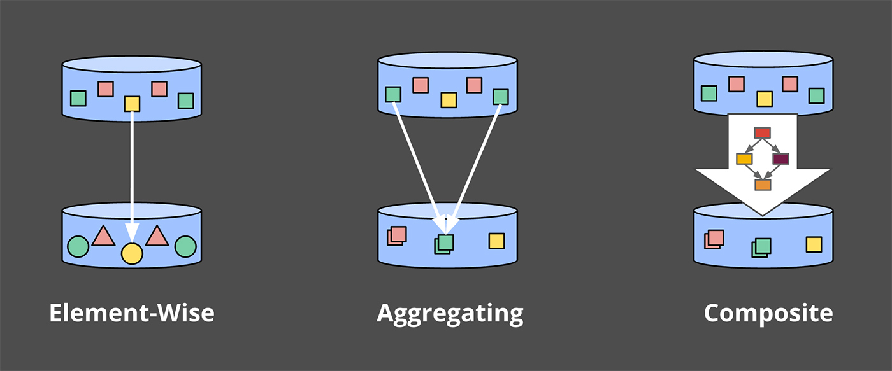

> Author: Tyler Akidau
>
> 原文连接: https://www.oreilly.com/radar/the-world-beyond-batch-streaming-102/
>
> Editor's Note: 这是关于数据处理演变两个系列中的第二部分，着重关注流式系统、无界数据集、以及大数据的未来

## 1. 介绍

欢迎回来，如果你错过了我之前的帖子 —— [The World beyond batch: Streaming 101]()，我强烈建议您花时间先阅读该内容。它为我将在这篇文章中介绍的主题奠定了必要的基础，并且我假设您已经熟悉那里介绍的术语和概念。~~Caveat lector and all that.~~

另外，需要注意的是，这篇文章包含许多动画，所以那些试图打印它的人会错过一些最好的部分。~~Caveat printor and all that.~~

简单回顾一下，上次我着重于三个主要领域：==术语(terminology)==，当我使用类似"streaming"等重载术语时，精确定义我(想表达)的意思；==批与流的比较(batch versus streaming)==，比较这两种系统的理论能力，并提出只有完成两件事才能使流式系统超越批处理系统：正确性和时间推理工具；==数据处理模式==，研究批处理系统和流式系统在处理有界和无界数据时采用的基本方法。

在这篇文章中，我想进一步关注上次的数据处理模式，但更详细，并且在具体示例的背景下。这篇文章的范围将包含两个部分：

- Streaming 101 回顾：简单回顾一下 Streaming 中介绍的概念，并添加了一个运行示例来突出重点
- Streaming 102：Streaming 101 的配套文章，详细介绍了在处理无界数据时很重要的其他概念，并继续使用具体示例作为解释它们的工具

当我们完成时，我们将涵盖我认为是稳健的==无序数据处理所需的核心原则和概念集==。这些时间推理的工具，将真正的让您超越经典的批处理。

为了让您了解他们在行动中的样子，我将使用 [Dataflow SDK](https://github.com/GoogleCloudPlatform/DataflowJavaSDK) 的代码片段(i.e., 用于 [Google Cloud Dataflow](https://cloud.google.com/dataflow/) 的 API)，加上动画以提供概念的视觉表现。我使用 Dataflow SDK 而不是人们可能更熟悉的东西(比如，Spark Streaming 或者 Storm)的原因是实际上没有其他系统可以为我想要涵盖的所有示例提供所需的表现力。好消息是，其他系统也开始朝这个方向发展。更好的消息是，我们(Google)今天向 Apache 软件基金会提交了一份提案，以创建一个 Apache Dataflow 孵化器项目(与 data Artisans、Cloudera、Talend 以及其他一些公司合作)，希望围绕 [Dataflow Model](http://www.vldb.org/pvldb/vol8/p1792-Akidau.pdf) 提供的强大的乱序处理语义建立一个开放的社区和生态系统。这应该是一个非常有趣的 2016 年。~~我离题了~~。

这篇文章中缺少的是我上次承诺的比较部分。我低估了我想在这篇文章中包含多少内容，以及我需要多少时间才能完成。在这一点上，我实在不想看到为了适应这一部分而进一步拖延和延伸的事情。如果右什么安慰的话，我最后在 Strata + Hadoop World Singapore 2015 上做了一个大规模数据处理的演变(The evolution of massive-scale data processing)的演讲(并且，将在6月份的 Strata + Hadoop World Singapore 2016 上给出它的更新版本)，这里面会提供缺失的比较部分的资料。幻灯片非常精美，[可以在这里找到](https://docs.google.com/presentation/d/10vs2PnjynYMtDpwFsqmSePtMnfJirCkXcHZ1SkwDg-s/present?slide=id.gd50fd6f86_0_224)供您阅读。~~Not quite the same, to be sure, but it’s something.~~

现在，继续 streaming (的话题)。

## 2. 回顾和路线图

在 Streaming 101 中，我首先澄清了一些术语。我首先区分了==有界数据==和==无界数据==。有界数据源的大小是有限的，通常被称为"批量"数据。无界数据可能具有无限大小，并且通常被称为"流式"数据。我尽量避免使用术语批处理和流式处理来指代数据源，因为这些名称带有某些具有误导性且通常具有限制性的含义。

然后我继续定义批处理引擎和流式处理引擎之间的区别：批处理引擎是那些在设计时只考虑有界数据的引擎，而流式引擎是在设计时考虑到无界数据的。我的目标是在提及执行引擎时仅使用术语 batch 和 streaming。

在术语之后，我介绍了与处理无界数据相关的两个重要的基本概念。我首先建立了事件时间(事件发生的事件)和处理时间(在处理过程中观察到的时间)之间的关键区别。这为 Streaming 101 中提出的主要论点之一奠定了基础：==如果您关心正确性和事件实际发生的上下文，则必须分析相对于固有事件时间的数据，而不是在分析过程中遇到它们的处理时间==。

然后我介绍了窗口化的概念(即，沿时间边界划分数据集)，这是一种常用的方法，用于应对技术上无界数据源可能永远不会结束的事实。一些更简单的窗口策略示例是固定窗口和滑动窗口，但更复杂的窗口类型，例如 session(窗口由数据本身的特征定义，例如，每隔一段时间捕获每个用户的活动会话)也可以看到广泛的用法。

除了这两个概念，我们现在将仔细研究另外三个概念:

- Watermarks(水位线)：水位线是关于事件时间的输入完整性的概念。时间值为 X 的水印表示："已观察到事件时间小于 X 的所有输入数据"。因此，当观察一个没有已知终点的无界数据源时，水位线可以作为一个进度指标。
- Triggers(触发器)：触发器是一种机制，用于声明相对于某些外部信号实现的窗口何时输出。触发器在选择何时发出输出时提供了灵活性。它还可以在窗口演变时多次观察窗口的输出。这又为随着时间的推移细化结果打开了大门，即允许在数据到达时提供推测结果以及处理上游数据（修订）随时间的变化或相对于水印较晚到达的数据(例如，移动场景，其中某人的手机在该人离线时记录各种动作及其事件时间，然后再重新连接时继续上传这些事件以进行处理)
- Accumulation(累积)：累积模式指定在同一窗口中观察到的多个结果之间的关系。这些结果可能完全脱节，即随着时间的推移代表独立的增量，或者它们之间可能存在重叠。不同的累积模式具有不同的语义和与之相关的成本，因此可以在各种用例中找到适用性。

最后，因为我认为为了使理解所有这些概念之间的关系变得更容易，我们将在回答四个问题的结构中重新审视旧的问题并探索新的问题，所有我提出的这些对每个无界数据处理的都至关重要：

- ***What* results are calculated?（计算结果是什么）** 这个问题由 pipeline(管道) 中的转换类型来回答。这包括了计算总和、构建histograms、训练机器学习模型等等。 这本质上也是经典批处理回答的问题。
- ***Where* in event time are results calculated?（在事件时间中，结果是在哪里计算的）** pipeline 中的事件时间窗口的使用回答了这个问题。这包括 Streaming 101 中的窗口（fixed，sliding，以及 session）常见示例，没有窗口概念的用例（例如，Streaming 101 中描述的与时间无关的处理；经典的批处理通常也属于这一类）和其他更复杂的窗口类型，例如，限时拍卖。另外请注意，如果将进入时间指定为记录到达系统时的事件时间，那它也可以包括处理时间窗口。
- ***When* in processing time are results materialized?（在处理时间中，结果什么时候物化的）** 这个问题是通过 Watermark(水位线) 和 Triggers(触发器) 的使用来回答。这个主题有无限的可能，但最常见的模式是使用 Watermark 来描绘给定窗口的输入何时结束，使用 Triggers 允许指定早期结果(对于在窗口完成之前发出的推测结果)和最终结果(Watermark 只是对完整性情况的估计，在 Watermark 声称给定窗口的输入完成后，可能会到达更多输入数据)
- ***How* do refinements of results relate?** 这个问题由所使用的累积类型来回答：丢弃(结果都是独立且不同的)，累积(后来的结果建立在先前的结果之上)，或者累积并回收(累积值和先前触发的值的回撤都被发出)

## 3. Streaming 101 redux

首先，让我们回顾一下Streaming 101中介绍的一些概念，但这一次将与一些详细的示例一起，这些示例将有助于使这些概念更加具体。

##### What：transformations（转换）

在经典批处理中应用的转换回答了一个问题：“What results are calculated?”尽管许多人可能已经熟悉经典的批处理，我们从这开始，并在这基础上添加所有其他的概念。

在本章节中，我们将看到一个示例：在由10个值组成的简单数据集上根据 Key 计算 Sum。

如果您熟悉 Spark Streaming 或者 Flink 之类的东西，那么您应该可以相对轻松的了解 Dataflow 代码在做什么。为了给你一个速成课程，Dataflow 中有两个基本原语：

- `PCollections`: 它表示数据集（可能是大量数据集），可以用过这些数据集执行并行转换
- `PTransforms`: 它应用于 PCollections 以创建新的 PCollections。PTransforms 可以执行元素级别的转换，可以将多个元素聚合在一起，也可以是其他 PTransform 的组合。



如果您发现自己感到困惑，或者只是想查阅参考资料，可以查看[DataflowJavaSDK文档](https://cloud.google.com/dataflow/model/programming-model)。

为了我们的示例，假设我们从一个名为 `input`（即，一个由字符串和整数组成的 KV 的 PCollect）的 `PCollection<KV<String, Integer>>` 开始，在现实世界的管道中，我们可以通过从 I/O 源读取原始数据（如：日志记录）的 PCollection 来获取数据，然后通过将日志记录解析为适当的 KV 键值对，将其转换为 `PCollection<KV<String, Integer>>` 。为了清楚起见，在第一个示例中，我将为所有这些步骤添加伪代码，但在随后的示例中，省略了I/O和解析部分。

因此，对于一个简单地从I/O源读入数据、解析出团队/得分对并计算每个团队得分总和的管道，我们会得到这样的结果：

```java
PCollection<String> raw = IO.read(...);
PCollection<KV<String, Integer>> input = raw.apply(ParDo.of(new ParseFn());
PCollection<KV<String, Integer>> scores = input
  .apply(Sum.integersPerKey());
```

对于接下来的所有示例，在看到描述我们将要分析的管道的代码片段之后，我们将查看在具体数据集上执行该管道的动画呈现。更具体地说，我们将看到在单个键的10个输入数据上执行管道是什么样子的；在一个真实的管道中，你可以想象类似的操作会在多台机器上并行进行，但是为了我们的例子，保持简单会更清楚。

每个动画在两个维度上绘制输入和输出：事件时间（在X轴上）和处理时间（在Y轴上）。因此，管道观察到的实时从下到上，如粗的上升白线所示。输入是圆圈，圆圈内的数字表示特定记录的值。当管道观察到它们时，它们开始变灰并改变颜色。

当管道观察值时，它在其状态下累积值，并最终将聚合结果具体化为输出。状态和输出由矩形表示，聚合值位于顶部附近，矩形覆盖的区域表示累积到结果中的事件时间和处理时间部分。对于清单1中的管道，当在经典的批处理引擎上执行时，它看起来像这样：


由于这是一个批处理管道，它会累积状态，直到看到所有输入（由顶部的绿色虚线表示），此时，它会产生51的单个输出。在本例中，我们计算了所有事件时间的总和，因为我们没有应用任何特定的窗口转换；因此，状态和输出矩形覆盖整个X轴。然而，如果我们想处理一个无界数据源，经典的批处理是不够的；我们不能等待输入结束，因为它实际上永远不会结束。我们想要的概念之一是窗口化，这是我们在Streaming 101中引入的。因此，在我们第二个问题背景下：“Where in event time are results calculated?”，我们现在将简要回顾窗口化。

##### Where：windowing（窗口化）

正如上次讨论的，窗口化是沿着时间边界分割数据源的过程。常见的窗口策略包括固定窗口、滑动窗口和会话窗口


为了更好地了解窗口化在实践中的样子，让我们使用整数求和管道，并将其窗口化为固定的两分钟窗口。使用Dataflow SDK，更改只是简单地添加了Window.into转换：

```java
PCollection<KV<String, Integer>> scores = input
  .apply(Window.into(FixedWindows.of(Duration.standardMinutes(2))))
  .apply(Sum.integersPerKey());
```

回想一下，Dataflow提供了一个在批处理和流处理中都有效的统一模型，因为从语义上讲，批处理实际上只是流处理的一个子集。因此，让我们首先在批处理引擎上执行此管道；机制更为简单，当我们切换到流式引擎时，它将为我们提供一些可以直接比较的东西。


和之前一样，输入在状态中累积，直到它们被完全消费，然后产生输出。然而，在本例中，我们得到了四个输出，而不是一个输出：四个两分钟的事件时间窗口，每一个都有一个输出

在这一点上，我们重新审视了Streaming 101中引入的两个主要概念：事件时间和处理时间之间的关系，窗口。

如果我们想更进一步，我们需要开始添加本节开头提到的新概念：Watermarks（水位线）、Triggers（触发器） 和 Accumulation（累积）。

## Streaming 102

我们刚刚观察了批处理引擎上窗口管道的执行情况。但理想情况下，我们希望结果的延迟更低，而且我们还希望能够处理无边界数据源。切换到流式引擎是朝着正确方向迈出的一步，但尽管批处理引擎有一个已知的点，即每个窗口的输入都是完整的（i.e.，一旦有界输入源中的所有数据都被消耗完），但我们目前缺乏一种用无边界数据源确定完整性的实用方法。

##### When：Watermarks

Watermarks 是这个问题答案的前半部分：“When in processing time are results materialized?”Watermarks 是事件时间域中输入完整性的概念。换言之，它们是系统相对于事件流中处理的记录的事件时间测量进度和完整性的方式（有界或无界，尽管在无界情况下它们的有用性更明显）。

回想一下Streaming 101中的这张图，在这里稍作修改，我将事件时间和处理时间之间的偏差描述为大多数真实世界分布式数据处理系统中不断变化的时间函数。


代表现实的那条蜿蜒的红线本质上就是Watermarks，它捕获了随着处理时间的推移事件时间完整性的进展。从概念上讲，可以将 Watermarks 视为一个函数F(P) -> E，它在处理时间上取一个点，在事件时间上返回一个点（更准确地说，函数的输入实际上是观察到水印的管道点上游所有事物的当前状态：输入源、缓冲数据、正在处理的数据等；但从概念上讲，将其视为从处理时间到事件时间的映射更简单）。事件时间点E是系统认为已观察到事件时间小于E的所有输入的时间点。换句话说，这是一个断言，即不会再看到事件时间小于E的数据。根据 Watermarks 的类型（准确的或启发式的），该断言可以是严格的保证，也可以是有根据的猜测：

- **Perfect Watermarks（准确的水位线）**: 在我们完全了解所有输入数据的情况下，有可能构建一个确切的水位线；在这种情况下，不存在延迟数据；所有数据都很早或准时
- **Heuristic Watermarks（启发式的水位线）**: 对于许多分布式输入源，完全了解输入数据是不切实际的，在这种情况下，另一个最佳选择是提供启发式水位线。启发式水位线使用关于输入的任何可用信息（分区、分区内的排序（如果有的话）、文件的增长率等）来提供尽可能准确的进度估计。在许多情况下，这样的水位线在预测中可以非常准确。即使如此，使用启发式水位线也意味着它有时可能是错误的，这将导致数据延迟。我们将在下面的触发器部分了解处理延迟数据的方法。

::: tip 人生得意须尽欢

这一刻，我觉得翻译失去了意义，我不想翻了！自行查看原文吧。

:::
