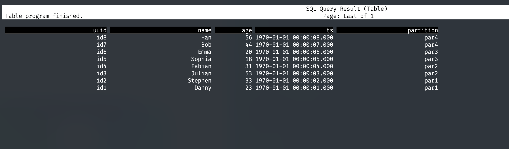

## Flink SQL Client 操作 Hudi 初体验

### 环境版本

[Flink 1.15.2](https://flink.apache.org/downloads.html)

Hudi 0.12.1 (自己打包的)

[flink-sql-connector-hive-2.2.0](https://nightlies.apache.org/flink/flink-docs-release-1.15/docs/connectors/table/hive/overview/)

### Hudi包

可供下载的地址：https://repo1.maven.org/maven2/org/apache/hudi/hudi-flink1.15-bundle/0.12.1/hudi-flink1.15-bundle-0.12.1.jar 

> 使用上述包，存在的问题未知，由于考虑到需要集成 Hive 一起使用，所以自己编译 Hudi 源码打的包。

如果想同步 Hive，需要使用 hive profile 自己打包,这里参考官网：https://hudi.apache.org/cn/docs/syncing_metastore/#flink-setup

使用的打包命令

```shell
mvn clean package -DskipTests -Dflink1.15 -Dscala-2.12 -Pflink-bundle-shade-hive2
```

> 需要将配置文件中的 hive 版本修改为集群的 hive 版本。修改地方位于：hudi项目下的 `packaging/hudi-flink-bundle/pom.xml`，文件底部的 profile 中的 `hive.version` 也需要更改

### 直接建表

直接创建的表，存在于<font color="red">内存</font>，关闭sql-client后，重新打开，需要重新创建表

```sql
## 建表语句
CREATE TABLE hudi_table1 (
  uuid VARCHAR(20) PRIMARY KEY NOT ENFORCED,
  name VARCHAR(10),
  age INT,
  ts TIMESTAMP(3),
  `partition` VARCHAR(20)
)
PARTITIONED BY (`partition`)
WITH (
  'connector' = 'hudi',
  'path' = 'hdfs:///user/root/hudi/warehouse/hudi_table1',
  'table.type' = 'MERGE_ON_READ'
);

# 插入数据
INSERT INTO hudi_table1 VALUES
  ('id1','Danny',23,TIMESTAMP '1970-01-01 00:00:01','par1'),
  ('id2','Stephen',33,TIMESTAMP '1970-01-01 00:00:02','par1'),
  ('id3','Julian',53,TIMESTAMP '1970-01-01 00:00:03','par2'),
  ('id4','Fabian',31,TIMESTAMP '1970-01-01 00:00:04','par2'),
  ('id5','Sophia',18,TIMESTAMP '1970-01-01 00:00:05','par3'),
  ('id6','Emma',20,TIMESTAMP '1970-01-01 00:00:06','par3'),
  ('id7','Bob',44,TIMESTAMP '1970-01-01 00:00:07','par4'),
  ('id8','Han',56,TIMESTAMP '1970-01-01 00:00:08','par4');
  
# 查询数据
SELECT * FROM hudi_table1;
```


### 通过 Hive Catalog 管理 Hudi 表

通过 Hive Catalog 管理的 Hudi 表，在下一次打开 sql-client，可以直接通过 Hive Catalog 使用 hudi 表，并且可以在 hive 中看到该表（当然，既然 Hive 中能看到，Impala 刷新 Hive 的元数据之后，也能看到），<font color="red">但是 hive 仍然无法查询该表</font>。

```sql
## 创建 hive_catalog
CREATE CATALOG hive_catalog 
WITH (
  'type' = 'hive',
  'default-database' = 'default',
  'hive-conf-dir' = '/etc/hive/conf'
);

USE CATALOG hive_catalog;

## hive_catalog 下创建 hudi 库
CREATE DATABASE hudi;

use hudi;

## 建表语句
CREATE TABLE hudi_table2 (
  uuid VARCHAR(20) PRIMARY KEY NOT ENFORCED,
  name VARCHAR(10),
  age INT,
  ts TIMESTAMP(3),
  `partition` VARCHAR(20)
)
PARTITIONED BY (`partition`)
WITH (
  'connector' = 'hudi',
  'path' = 'hdfs:///user/root/hudi/warehouse/hudi_table2',
  'table.type' = 'MERGE_ON_READ'
);

## 插入数据
INSERT INTO hudi_table2 VALUES
  ('id1','Danny',23,TIMESTAMP '1970-01-01 00:00:01','par1'),
  ('id2','Stephen',33,TIMESTAMP '1970-01-01 00:00:02','par1'),
  ('id3','Julian',53,TIMESTAMP '1970-01-01 00:00:03','par2'),
  ('id4','Fabian',31,TIMESTAMP '1970-01-01 00:00:04','par2'),
  ('id5','Sophia',18,TIMESTAMP '1970-01-01 00:00:05','par3'),
  ('id6','Emma',20,TIMESTAMP '1970-01-01 00:00:06','par3'),
  ('id7','Bob',44,TIMESTAMP '1970-01-01 00:00:07','par4'),
  ('id8','Han',56,TIMESTAMP '1970-01-01 00:00:08','par4');
  
## 查询
SELECT * FROM hudi_table2;
```



##### 在 hive 中查看该表，并尝试查询。


### 异常解决

#### 1. sql-client 提交 INSERT 语句成功，查询无数据。

通过 Web UI 发现，任务失败了，taskmanager 日志显示报错信息 `java.lang.ClassNotFoundException: org.apache.hadoop.fs.Path`

**解决方案：**

为 flink 添加 `flink-shaded-hadoop-2-uber-3.0.0-cdh6.3.2-9.0.jar` 依赖，即可解决。