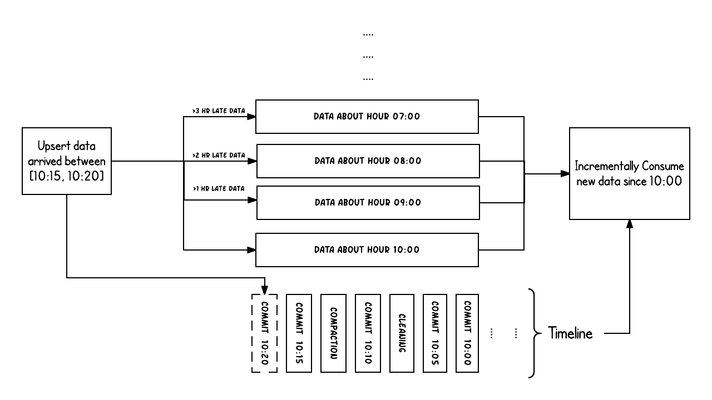

## TimeLine

Hudi 维护了表上在不同时刻所执行的所有操作的时间线，这有助于提供表的即时视图，同时也有效地支持按到达顺序检索数据。

Hudi 的 instant 由以下部分组成：

- `Instant Action`: 在表上执行的操作类型
- `Instant Time`: 即时时间通常是时间戳(e.g: 20190117010349)，它按动作开始时间的顺序单调增加
- `State`: 当前instant的状态

Hudi保证在时间线上执行的操作是原子的，并且基于即时时间的时间线是一致的。

### Instant Action

操作包括：

- `Commit` - 一次Commit表示将一批记录**原子写入**到table中。
- `Clean` - 后台行为，删除表中不再需要的旧版本文件。
- `Delta_Commit` - delta commit 指的是将一批记录**原子写入**到MOR表，其中部分数据或所有数据直接写入增量日志。
- `Compaction` - 后台行为，合并Hudi内部不同的数据结构。例如：将更新从基于行的log文件移动到列式存储的数据文件。在内部，Compaction 表现为时间轴上的一种特殊Commit。
- `Rollback` - 表示 Commit 或 Delta Commit 失败时进行回滚，其删除所有该写入过程中生成的部分文件
- `Savepoint` - 将一些文件组标记为"saved"，使其不会被删除。在需要恢复数据情况下，它有助于将表恢复到timeline上的某个点

### State

任何给定的instant都可以处于以下状态之一

- `Requested`: 代表操作已经安排妥当，但并未启动
- `Inflight`: 当前操作正在执行中
- `Completed`: 在 timeline 上的操作已完成

### Hudi 中的两个时间概念

在 Hudi 中，需要区分两个重要的时间概念：

- Arrival Time：数据到达 Hudi 的时间，即 Commit Time
- Event Time：数据实际发生的时间

上面的示例显示了在Hudi时间线上，Hudi表在10:00到10:20之间发生的upsert，大约每5分钟发生一次留下的Commit元数据，以及其他后台清理/合并操作。

从图中可以看出，当延迟数据到达时，都可以被正确的写入到对应时段的数据文件中。在 timeline 的帮助下，尝试增量消费自10:00以来的新数据时，可以只从变更文件中非常高效地获取，而无需扫描所有时间段。

