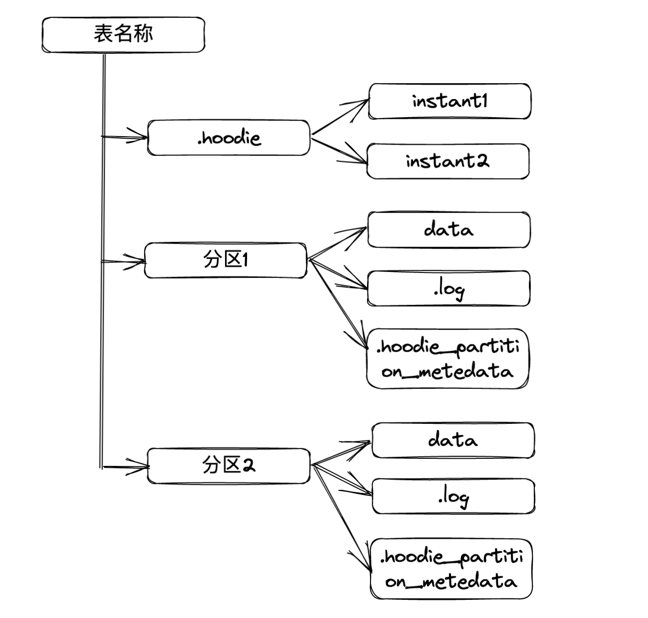

## 文件布局

- Hudi 将数据表组织到分布式文件系统上基本路径的目录结构中
- 表可以被划分为多个分区
- 在每个分区中，文件被组织成文件组，由文件id作为唯一标识
- 每个文件组包含多个文件切片
- 每个切片包含：
  1. 在某个Commit或合并瞬间生成的基本数据文件（.parquet）
  2. 一组日志文件（.log.*），这些文件包含自生成基本数据文件以来所有的对基本数据文件的插入和更新。(COW表没有)
- Hudi合并操作合并日志和基本文件以生成新的文件切片，以及清理操作清除未使用的和旧的文件切片，以回收文件系统上的空间，都==采用了多版本并发控制（MVCC）==。

上图描述了Hudi的通用文件布局结构。从上图可以看出，Hudi 将存储分为两部分：

1. 元数据

   元数据存储在`.hoodie`目录下，其中包含了Timeline信息、hoodie配置、归档目录等，Timeline信息以文件形式存在，该文件命名为`instant time.instant action[.state]`

2. 数据

   Hoodie 的数据存储与Hive一样，以分区的形式存储数据（当然，也可以没有分区）。
   
   分区内存放基本的数据文件(.parquet)和操作日志文件(.log.*)。
   
   `.hoodie_partition_metadata` 文件描述了该分区的创建时间、分区层级等信息。

