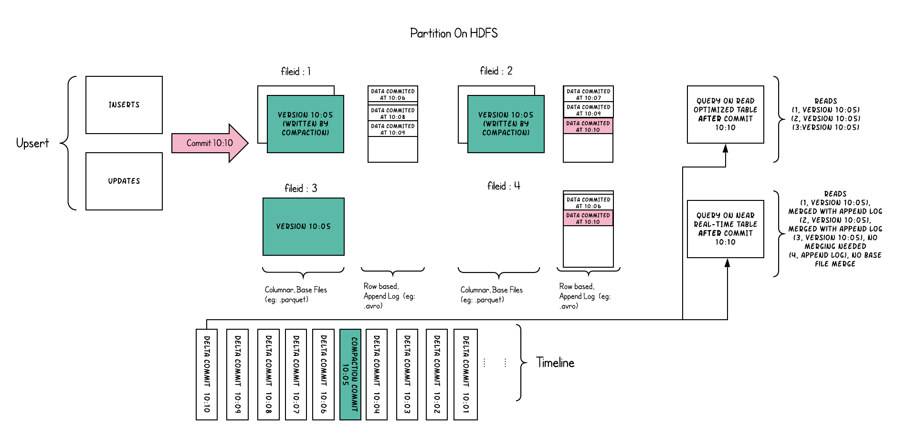

表类型定义了如何在文件系统上对数据进行索引和布局，以及如何在这样的组织之上实现对数据进行索引和布局和timeline活动（即如何写入数据）。

查询类型定义了底层数据如何向查询公开（即如何读取数据）。

## 表类型

Hudi 支持 Merge On Read（以下简称 MOR） 和 Copy On Write（一下简称 COW） 两种表类型

- Merge On Read

  使用==列式文件格式（Parquet）和行式文件格式（Avro）混合的方式==来存储数据。

  列式格式存放 Base 数据，同时使用行式格式存放增量数据。

  更新操作，通过将最新写入的增量数据存放至行式文件中，根据配置的合并策略执行合并操作，将增量数据合并至列式文件中。

- Copy On Write

  只是用==列式文件格式==存储数据。

  更新操作，通过在写入期间执行同步合并，仅对文件进行版本更新和重写。

两种表类型的差异

| Trade-off                       | Copy On Write         | Merge On Read         |
| :------------------------------ | :-------------------- | :-------------------- |
| 数据延迟（Data Latency）        | 高                    | 低                    |
| 查询延迟（Query Latency）       | 低                    | 高                    |
| 更新开销（Update cost (I/O)）   | 高（重写整个Parquet） | 低（追加到Delta Log） |
| Parquet File 大小               | 小（高更新(I/O)开销） | 大（低更新开销）      |
| 写入放大（Write Amplification） | 高（写入放大较高）    | 低（取决于合并策略）  |

> Write Amplification：写入放大，简称 WA，是闪存和固态硬盘（SSD）中一种不良的现象，即实际写入的物理数据量是写入数据量的多倍。

### Copy On Write 表

COW表中的文件切片仅包含基本/列文件，每次提交都会生成新版本的基本文件。换句话说，我们在每次提交时都隐式合并，这样就只存在列式数据。因此，写入放大率（为1字节的输入数据写入的字节数）高得多，其中读取放大率为零。这是分析工作负载非常需要的属性，因为分析工作负载主要是重读取的。

下面从概念上说明了当数据写入到COW表中并在其上运行两个查询时，这是如何工作的。

当数据被写入时，对现有文件组的更新会为该文件组生成一个新的切片，该切片标记有提交即时时间，而插入会分配一个新文件组并为该文件群写入其第一个切片。这些文件切片及其提交时间在上面用颜色编码。针对此类表运行的SQL查询(例如：`SELECT COUNT(*)` 计算该分区中的总记录)，首先检查最新提交的时间线，并过滤每个文件组中除最新文件片段之外的所有文件片段。正如您所看到的，一个旧的查询不会看到当前正在提交的文件(以粉色编码的)，而是在提交后开始的一个新的查询会拾取新的数据。因此，查询不受任何写入失败/部分写入的影响，仅在已提交的数据上运行。

COW表的目的，是从根本上改进表的管理：

- 支持在文件级自动更新数据，而不是重写整个表/分区
- 能够增量消费变更，而不是使用浪费资源的扫描
- 严格控制文件大小以保持优异的查询性能（小文件极大地影响了查询性能）

### Merge On Read 表

MOR表是COW表的超集，从某种意义上说，它仍然通过在最新的文件切片中只显示基本/列式文件来支持表的读取优化查询。此外，它将每个文件组传入的 upsert 存储到基于行的增量日志中，以支持增量快照查询，即在查询期间将增量日志应用到每个文件id的最新版本上。因此，这种表类型试图平衡读和写的放大，以提供接近实时的数据。这里最重要的变化是合并程序，它需要仔细地选择将哪些增量日志文件合并到其列式基础文件中，以保持查询性能的检查。（较大的增量日志文件将导致在查询端合并数据时的合并时间更长）

下面说明了该表的工作原理，并显示了两种类型的查询：快照查询和读取优化查询。

- 我们现在每1分钟左右就会提交一次，这是其他表类型无法做到的。
- 在每个文件id组中，现在有一个增量日志文件，它保存了对基本列式文件中的记录的更新。在示例中，增量日志文件保存10:05到10:10之间的所有数据。与之前一样，基本列式文件仍然使用Commit进行版本控制。因此，如果只查看基本文件，那么表布局看起来就像一个COW表。
- 定期合并过程从增量日志中协调这些更改，并生成新版本的基础文件，就像示例中10:05发生的情况一样。
- 查询同一基础表有两种方法：读取优化查询和快照查询，这取决于我们选择的是查询性能还是数据的新鲜度。
- 当来自提交的数据可用于查询时，对于读优化查询，语义会以微妙的方式发生变化。例如一个在10:10运行的查询，将不会看到10:05之后数据，而快照查询总是看到最新的数据。
- 当我们触发合并时，决定合并什么，这是解决这些难题的关键。通过实施合并策略（与旧分区相比，及时合并最新分区），可以确保读取优化的查询在X分钟内以一致的方式查看发布的数据。

MOR表的目的是直接在文件系统上实现近实时的处理，而不是将数据复制到可能无法处理这些数据量的专用系统上。MOR表还有一些其他的好处，例如通过避免数据的同步合并来减少写入放大

## 查询类型

Hudi支持快照查询、增量查询和读取优化查询。

- 快照查询(Snapshot Queries)

  查询可以看到给定的Commit或合并时表的最新快照。

  对于MOR表，它通过动态合并最新文件切片的基本文件和增量文件来暴露近乎实时的数据（几分钟）。

  对于COW表，它提供了对已存在的parquet表的直接替换，同时提供了upsert/delete和其他写入端的功能。

- 增量查询(Incremental Queries)

  查询只可以看到给定的Commit或合并时表最新写入的数据。这有效地提供了change流，用于启用增量数据管道。

- 读取优化查询(Read Optimized Queries)

  查询可以看到给定的Commit或合并时表的最新快照。只显示最新文件切片中的基本/列式文件，并保证与非hudi的列式表相比，具有相同的列式查询性能。

快照查询和读取优化查询两种查询类型的差异

| Trade-off                 | Snapshot Queries                                 | Read Optimized Queries        |
| :------------------------ | :----------------------------------------------- | :---------------------------- |
| 数据延迟（Data Latency）  | 低                                               | 高                            |
| 查询延迟（Query Latency） | 高（合并基本/列式文件 + 基于增量日志的行式文件） | 低（原始的基础/列式文件展示） |