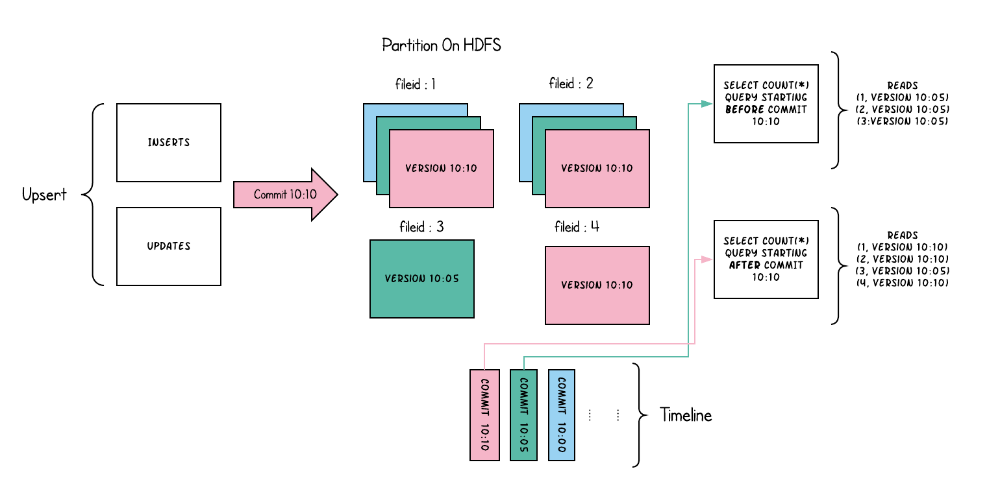

## 定位

官方将Hudi定位为**流式数据湖**平台，提供了直连数据湖的核心数仓和数据库的功能。

在其使用上，不同于传统的数据库，它并没有需要安装的服务，它仅仅只是一个Jar包，或可称为一个SDK包。

这一点上，与Iceberg一样，或许Hudi也可以跟Iceberg一样，将其称为一种 **Table Format**，当然 Hudi 不仅仅是一种 Table Format

## 特性

- 支持流式工作负载
- 支持增量批处理管道，支持增量查询
- 记录级的变更流

- 支持事务、回滚
- 并发控制
- 支持 Schema 演进和约束
- 支持索引
- 支持Upsert、Delete
- 自动文件大小管理、合并、清理
- 支持 Flink、Spark、Hive 等引擎的 SQL 读写
- 支持构建 CDC 采集

## 整体设计

##### 存储

可以基于各厂商的云存储、HDFS进行数据和元数据的存储

##### File Format

程序内部以 Avro 作为数据结构，落地默认存储使用 Parquet，支持 Parquet、HFile、ORC

##### 事务型的数据库内核

支持并发控制、表服务、索引、湖缓存、Table Format、Timeline

##### SQL 层面 API

支持 Spark、Flink

##### 生态

支持 Presto、Hive、Spark、Flink

## 应用场景

- 近实时数据摄取

  Hudi支持插入、更新和删除数据的能力。您可以实时摄取消息队列（Kafka）和日志服务SLS等日志数据至Hudi中，同时也支持实时同步数据库Binlog产生的变更数据。

  Hudi优化了数据写入过程中产生的小文件。因此，相比其他传统的文件格式，Hudi对HDFS文件系统更加的友好。

- 近实时数据分析

  Hudi支持多种数据分析引擎，包括Hive、Spark、Presto和Impala。Hudi作为一种文件格式，不需要依赖额外的服务进程，在使用上也更加的轻量化。

- 增量数据处理

  Hudi支持Incremental Query查询类型，您可以通过Spark Streaming查询给定COMMIT后发生变更的数据。Hudi提供了一种消费HDFS变化数据的能力，可以用来优化现有的系统架构。

## 表类型

表类型定义了如何在文件系统上对数据进行索引和布局，以及如何在这样的组织之上实现对数据进行索引、布局和timeline活动（即如何写入数据）。

查询类型定义了底层数据如何向查询公开（即如何读取数据）。

Hudi 支持 Merge On Read（以下简称 MOR） 和 Copy On Write（一下简称 COW） 两种表类型

- Merge On Read

  使用==列式文件格式（Parquet）和行式文件格式（Avro）混合的方式==来存储数据。

  列式格式存放 Base 数据，同时使用行式格式存放增量数据。

  更新操作，通过将最新写入的增量数据存放至行式文件中，根据配置的合并策略执行合并操作，将增量数据合并至列式文件中。

- Copy On Write

  只使用==列式文件格式==存储数据。

  更新操作，通过在写入期间执行同步合并，仅对文件进行版本更新和重写。

两种表类型的差异

| Trade-off                       | Copy On Write         | Merge On Read         |
| :------------------------------ | :-------------------- | :-------------------- |
| 数据延迟（Data Latency）        | 高                    | 低                    |
| 查询延迟（Query Latency）       | 低                    | 高                    |
| 更新开销（Update cost (I/O)）   | 高（重写整个Parquet） | 低（追加到Delta Log） |
| Parquet File 大小               | 小（高更新(I/O)开销） | 大（低更新开销）      |
| 写入放大（Write Amplification） | 高（写入放大较高）    | 低（取决于合并策略）  |

> Write Amplification：写入放大，简称 WA，是闪存和固态硬盘（SSD）中一种不良的现象，即实际写入的物理数据量是写入数据量的多倍。

## 查询类型

Hudi支持快照查询、增量查询和读取优化查询。

- 快照查询(Snapshot Queries)

  查询可以看到给定的Commit或合并时表的最新快照。

  对于MOR表，它通过动态合并最新文件切片的基本文件和增量文件来暴露近乎实时的数据（几分钟）。

  对于COW表，它提供了对已存在的parquet表的直接替换，同时提供了upsert/delete和其他写入端的功能。

- 增量查询(Incremental Queries)

  查询只可以看到给定的Commit或合并以来表最新写入的数据。这有效地提供了change流，用于启用增量数据管道。

- 读取优化查询(Read Optimized Queries)

  查询可以看到给定的Commit/合并时表的最新快照。只显示最新文件切片中的列式文件，并保证与非hudi的列式表相比，具有相同的列式查询性能。

快照查询和读取优化查询两种查询类型的差异

| Trade-off                 | Snapshot Queries                                 | Read Optimized Queries        |
| :------------------------ | :----------------------------------------------- | :---------------------------- |
| 数据延迟（Data Latency）  | 低                                               | 高                            |
| 查询延迟（Query Latency） | 高（合并基本/列式文件 + 基于增量日志的行式文件） | 低（原始的基础/列式文件展示） |

### Copy On Write 表

COW表中的文件切片仅包含列式文件(.parquet)，没有增量日志文件(.log.*)，每次提交都会生成新版本的基本文件。换句话说，我们在每次提交时都隐式合并，这样就只存在列式数据。因此，写入放大率（为1字节的输入数据写入的字节数）高得多，其中读取放大率为零。这是分析工作负载非常需要的属性，因为分析工作负载主要是重读取的。

下面从概念上说明了当数据写入到COW表中并在其上运行两个查询时，这是如何工作的。

当数据被写入时，对现有文件组的更新会为该文件组生成一个新的切片，该切片标记有提交即时时间，而插入会分配一个新文件组并为该文件群写入其第一个切片。这些文件切片及其提交时间在上面用颜色编码。针对此类表运行的SQL查询(例如：`SELECT COUNT(*)` 计算该分区中的总记录)，首先检查最新提交的时间线，并过滤每个文件组中除最新文件片段之外的所有文件片段。正如您所看到的，一个旧的查询不会看到当前正在提交的文件(以粉色编码的)，而是在提交后开始的一个新的查询会拾取新的数据。因此，查询不受任何写入失败/部分写入的影响，仅在已提交的数据上运行。

COW表的目的，是从根本上改进表的管理：

- 支持在文件级自动更新数据，而不是重写整个表/分区
- 能够增量消费变更，而不是使用浪费资源的扫描
- 严格控制文件大小以保持优异的查询性能（小文件极大地影响了查询性能）

### Merge On Read 表

MOR表是COW表的超集，从某种意义上说，它仍然通过在最新的文件切片中只显示列式文件来支持表的读取优化查询。此外，它将每个文件组传入的 upsert 存储到基于行的增量日志中，以支持增量快照查询，即在查询期间将增量日志应用到每个文件id的最新版本上。因此，这种表类型试图平衡读和写的放大，以提供接近实时的数据。这里最重要的变化是合并程序，它需要仔细地选择将哪些增量日志文件合并到其列式基础文件中，以保持查询性能的检查。（较大的增量日志文件将导致在查询端合并数据时的合并时间更长）

下面说明了该表的工作原理，并显示了两种类型的查询：快照查询和读取优化查询。

- 我们现在每1分钟左右就会提交一次，这是其他表类型无法做到的。
- 在每个文件id组中，现在有一个增量日志文件，它保存了对基本列式文件中的记录的更新。在示例中，增量日志文件保存10:05到10:10之间的所有数据。与之前一样，基本列式文件仍然使用Commit进行版本控制。因此，如果只查看基本文件，那么表布局看起来就像一个COW表。
- 定期合并过程从增量日志中协调这些更改，并生成新版本的基础文件，就像示例中10:05发生的情况一样。
- 查询同一基础表有两种方法：读取优化查询和快照查询，这取决于我们选择的是查询性能还是数据的新鲜度。
- 当来自提交的数据可用于查询时，对于读优化查询，语义会以微妙的方式发生变化。例如一个在10:10运行的查询，将不会看到10:05之后数据，而快照查询总是看到最新的数据。
- 当我们触发合并时，决定合并什么，这是解决这些难题的关键。通过实施合并策略（与旧分区相比，及时合并最新分区），可以确保读取优化的查询在X分钟内以一致的方式查看发布的数据。

MOR表的目的是直接在文件系统上实现近实时的处理，而不是将数据复制到可能无法处理这些数据量的专用系统上。MOR表还有一些其他的好处，例如通过避免数据的同步合并来减少写入放大

## 索引 Indexing

Hudi 通过一种索引机制提供高效地 Upsert，这种机制具体是将给定的 hoodie key(record key + partition path) 与文件id建立唯一映射。这种映射关系在第一次写入到文件中后将不再更改。简而言之，映射文件组包含了一组record的所有版本。

对于 COW 表，索引可以实现快速的 upsert/delete 操作，避免了需要结合整个数据集来确定文件是否重写。

对于 MOR 表，这种设计允许 Hudi 限定所有给定的基本文件需要合并的记录数量。具体来说，给定的基本文件只需要根据作为该基本文件一部分的记录的更新进行合并。没有索引组件（例如：Apache Hive ACID）的设计可能最终不得不根据所有传入的更新/删除记录合并所有基本文件。

索引机制，可以做到：避免读取不需要的文件、避免更新不必要的文件、无需将更新数据与历史数据做分布式关联，只需要在文件组内做合并

### 索引类型

| 索引类型                | 原理                                                         | 优点                                          | 缺点                                                         |
| ----------------------- | ------------------------------------------------------------ | --------------------------------------------- | ------------------------------------------------------------ |
| Bloom Index             | 使用基于 record key 构建的布隆过滤器判断记录是否存在，也可以选择使用 record key ranges 修剪需要的文件 | 效率高，不依赖外部系统，数据和索引保持一致性  | 因Hash冲突问题导致的误判，还需要回溯原文件重新查             |
| Simple Index            | 将传入的 update/delete 记录根据 key 与存储在表中的数据进行关联 | 实现最简单，无需额外的资源                    | 性能差                                                       |
| HBase Index             | 在HBase中管理索引映射                                        | 对于小批次的key，查询效率高                   | 需要额外维护HBase系统                                        |
| 自定义实现              | 拓展公共API，实现自定义索引                                  | 灵活度高                                      | 需要一定的开发能力                                           |
| 基于 Flink State 的索引 | Hudi 在0.8.0版本中实现了Flink Writer，采用了 Flink 的 state 作为底层的索引存储，每个 record 在写入之前都会先计算目标 Bucket ID | 相比BloomFilter，避免了每次重复的文件索引查找 | 过大的索引，会导致内存使用变大，影响到 Checkpoint，随可以通过Flink的状态调优调整，但是需要对Flink有一定的使用经验 |

> ==在 Flink 中使用 Hudi，只有 基于 state 的索引==，其余索引都是 Spark 的可选配置。

#### 全局索引与非全局索引

- 全局索引: 全局索引在表的所有分区中强制要求 key 的唯一性，保证对于给定的 record key，在表中只存在一条记录。全局索引提供了有力的保证，但是 update/delete 成本随表的大小而增加，因此适用于小表
- 非全局索引: 默认的索引实现，非全局索引依赖写入器为同一个 record key 的 update/delete 提供一致的分区路径，从而提供更好的性能，因此更适合大表

> HBase Index 本质上就是一个全局索引。

## 文件布局

- Hudi 将数据表组织到分布式文件系统上基本路径的目录结构中
- 表可以被划分为多个分区
- 在每个分区中，文件被组织成文件组，由文件id作为唯一标识
- 每个文件组包含多个文件切片
- 每个切片包含：
  1. 在某个Commit或合并瞬间生成的基本数据文件（.parquet）
  2. 一组日志文件（.log.*），这些文件包含自生成基本数据文件以来所有的对基本数据文件的插入和更新。(COW表没有)
- Hudi合并操作合并日志和基本文件以生成新的文件切片，以及清理操作清除未使用的和旧的文件切片，以回收文件系统上的空间，都==采用了多版本并发控制（MVCC）==。

上图描述了Hudi的通用文件布局结构。从上图可以看出，Hudi 将存储分为两部分：

1. 元数据

   元数据存储在`.hoodie`目录下，其中包含了Timeline信息、hoodie配置、归档目录等，Timeline信息以文件形式存在，该文件命名为`instant time.instant action[.state]`

2. 数据

   Hoodie 的数据存储与Hive一样，以分区的形式存储数据（当然，也可以没有分区）。

   分区内存放基本的数据文件(.parquet)和操作日志文件(.log.*)。

   `.hoodie_partition_metadata` 文件描述了该分区的创建时间、分区层级等信息。

## TimeLine

Hudi 维护了表上在不同时刻所执行的所有操作的时间线，这有助于提供表的即时视图，同时也有效地支持按到达顺序检索数据。

Hudi 的 instant 由以下部分组成：

- `Instant Action`: 在表上执行的操作类型
- `Instant Time`: 即时时间通常是时间戳(e.g: 20190117010349)，它按动作开始时间的顺序单调增加
- `State`: 当前instant的状态

Hudi保证在时间线上执行的操作是原子的，并且基于即时时间的时间线是一致的。

### Instant Action

操作包括：

- `Commit` - 一次Commit表示将一批记录**原子写入**到table中。
- `Clean` - 后台行为，删除表中不再需要的旧版本文件。
- `Delta_Commit` - delta commit 指的是将一批记录**原子写入**到MOR表，其中部分数据或所有数据直接写入增量日志。
- `Compaction` - 后台行为，合并Hudi内部不同的数据结构。例如：将更新从基于行的log文件移动到列式存储的数据文件。在内部，Compaction 表现为时间轴上的一种特殊Commit。
- `Rollback` - 表示 Commit 或 Delta Commit 失败时进行回滚，其删除所有该写入过程中生成的部分文件
- `Savepoint` - 将一些文件组标记为"saved"，使其不会被删除。在需要恢复数据情况下，它有助于将表恢复到timeline上的某个点

### State

任何给定的instant都可以处于以下状态之一

- `Requested`: 代表操作已经安排妥当，但并未启动
- `Inflight`: 当前操作正在执行中
- `Completed`: 在 timeline 上的操作已完成

### Hudi 中的两个时间概念

在 Hudi 中，需要区分两个重要的时间概念：

- Arrival Time：数据到达 Hudi 的时间，即 Commit Time
- Event Time：数据实际发生的时间

上面的示例显示了在Hudi时间线上，Hudi表在10:00到10:20之间发生的upsert，大约每5分钟发生一次留下的Commit元数据，以及其他后台清理/合并操作。

从图中可以看出，当延迟数据到达时，都可以被正确的写入到对应时段的数据文件中。在 timeline 的帮助下，尝试增量消费自10:00以来的新数据时，可以只从变更文件中非常高效地获取，而无需扫描所有时间段。

