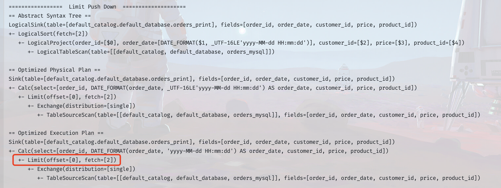

在研究 Flink SQL 优化时，涉及到一个术语——《谓词下推》。虽然知道谓词下推大概是个什么概念，但是脑袋里蹦出了一个问题，明明是由上游先进行过滤后，在推给下游，为什么被称为下推？抱着这个问题，也就顺便完整了解了一下什么是谓词下推。

::: tip Tips

此处提到“上游”、“下游”是针对 SQL 执行计划而言

:::

## 定义

谓词下推（Predicate Push Down），又称为 Filter Push down，是一种查询优化技术，用于在执行查询时将谓词（即查询条件）下推到数据源（如关系型数据库）中，在数据被读取前尽可能的过滤掉无关的数据，从而提高查询性能。

谓词：在 SQL 中，谓词（Predicate）即条件表达式，就是返回 boolean 值的函数，或是隐式转换为 boolean 的函数。

下推：至于为什么是下推，单纯是因为数据存储层是作为底层了，通过 SQL 查询数据时，从数据文件中读取数据到内存加工到最后展现，整个过程是自下而上的过程。

## Flink SQL 中的谓词下推

Flink SQL 中实现完整谓词下推的仅 `FileSystemTableSource`。

那么 Flink 到底提供了哪些接口用于拓展谓词下推呢？

1. [SupportsFilterPushDown](#supportsfilterpushdown)
2. [SupportsLimitPushDown](#supportslimitpushdown)
4. [SupportsProjectionPushDown](#supportsprojectionpushdown)

### SupportsFilterPushDown

<p style="color: #fa5d19">应用场景：将 where 中的过滤条件下推到 Source 中进行处理，这样不需要的数据就可以不往下游发送了，性能会有提升</p>

<v-icon name='pr-times-circle' fill='#E84B3C' /> 以 JDBC Connector 为例，以下是默认未实现`SupportsFilterPushDown`时的执行计划，可以很明显的看到，有一个专门的算子链节点用于处理过滤条件


<v-icon name='pr-check-circle' fill='#31C46E' /> 以下是重写了 `JdbcDynamicTableSource` ，实现了 `SupportsFilterPushDown` 接口后的执行计划，可以看到 Flink 将 where 的过滤条件下推到了 Source 端，在查询时就过滤掉不符合条件的数据


重写 `JdbcDynamicTableSource`，实现方式

```java
public class JdbcDynamicTableSource
        implements ScanTableSource,
        LookupTableSource,
        SupportsFilterPushDown, // 此处新增实现 SupportsFilterPushDown 接口
        SupportsProjectionPushDown,
        SupportsLimitPushDown {
          
          
          // 省略其他原先代码
          
          /**
           * 1. 该方法的作用是将filters(过滤条件)应用到当前的DynamicTableSource上
           * 2. 该方法的返回值是一个Result对象，该对象包含两个List<ResolvedExpression>类型的属性，
           *    分别是acceptedFilters(接受的过滤条件)和remainingFilters(剩余的过滤条件)
           * 3. acceptedFilters是指那些被DynamicTableSource使用的filters，
           *    但是这些filters可能只是尽可能在原基础上被应用，
           *    因此，这些filters的信息可以帮助planner来调整当前plan的成本估算
           * 4. remainingFilters是指那些不能被DynamicTableSource完全消费的filters，
           *    这些filters决定了是否需要在runtime阶段继续应用filter操作
           * 5. acceptedFilters和remainingFilters不能是disjunctive lists，
           *    一个filter可以同时出现在这两个list中，但是所有的filters必须至少出现在其中一个list中
           */
          @Override
          public Result applyFilters(List<ResolvedExpression> filters) {
              this.filters = filters;
              return Result.of(this.filters, Lists.newArrayList());
          }
          
          public boolean equals(Object o) {
            
            if (this == o) {
              return true;
            } else if (!(o instanceof JdbcDynamicTableSource)) {
              return false;
            } else {
              JdbcDynamicTableSource that = (JdbcDynamicTableSource)o;
              return Objects.equals(this.options, that.options)
                && Objects.equals(this.readOptions, that.readOptions)
                && Objects.equals(this.lookupOptions, that.lookupOptions)
                && Objects.equals(this.physicalRowDataType, that.physicalRowDataType)
                && Objects.equals(this.dialectName, that.dialectName)
                && Objects.equals(this.limit, that.limit)
                // Jdbc Connector 重写了 equals 方法，需要加上新增的 filters 属性
                && Objects.equals(this.filters, that.filters);
              }
          }
          
          public int hashCode() {
            return Objects.hash(
              new Object[]{
                this.options,
                this.readOptions,
                this.lookupOptions,
                this.physicalRowDataType,
                this.dialectName,
                this.limit,
                // Jdbc Connector 重写了 hashCode 方法，需要加上新增的 filters 属性
                this.filters
              });
          }
}
```

::: tip 其他重写方案

上述实现 `SupportsFilterPushDown` 接口，仅将过滤条件应用于 DynamicTableSource，对于 Jdbc Connector 而言，也可以将过滤条件同时应用于运行时 ，这样的话，就可以在 `getScanRuntimeProvider` 方法中，拿到过滤条件，将其拼接到`query`语句中，从而实现在数据库读取时就过滤到不需要的数据

:::

### SupportsLimitPushDown

<p style="color: #fa5d19">应用场景：将 limit 子句下推到 Source 中，在批场景中可以限制数据的流动量</p>

<v-icon name='pr-times-circle' fill='#E84B3C' /> 还是以 JDBC Connector 为例，以下是默认未实现`SupportsLimitPushDown`时的执行计划，可以看到，只有一个专门的算子链节点用于处理 Limit 限制，此时，从`TableSourceScan`节点到`Limit`节点，数据的流动量会很大，而且 Scan 的效率就会影响到整体的执行效率



<v-icon name='pr-check-circle' fill='#31C46E' /> 以下实现了 `SupportsLimitPushDown` 接口后的执行计划，可以看到 Flink 将 Limit 条件下推到了 Source 端，在查询时就限制了数据条数，从而整个算子链中的流动的数据量减少，可以在一些批处理场景大大提高效率，以及减少 source 端的查询压力


::: tip 实现方式

Limit 下推的实现方式，主要就是在`DynamicTableSource` 类中定义 `limit` 属性，然后实现 `SupportsLimitPushDown` 接口，将传入的 Limit 值赋给定义的  `limit` 属性，之后就可以在运行时使用 `limit` 属性限制数据条数，具体可以参考 `JdbcDynamicTableSource`、`HiveTableSource`、`FileSystemTableSource`

:::

### SupportsProjectionPushDown

<p style="color: #fa5d19">应用场景：将下游用到的字段下推到 Source 中，然后 Source 中可以做到只取这些字段，不使用的字段就不往下游发</p>

<v-icon name='pr-times-circle' fill='#E84B3C' /> 从下图可以看出，在未实现`SupportsProjectionPushDown`时，下游只需要所有字段中的一部分，source 端依旧会获取到所有字段内容，并且需要一个单独的 select 算子链来筛选下游需要的列


<v-icon name='pr-check-circle' fill='#31C46E' /> 以下时实现了 `SupportsProjectionPushDown` 接口后的执行计划，可以看到 Flink 查询列下推到了 Source 端，在查询时就限制了查询列，并减少了算子链长度


## 其他优化拓展 Source 能力的接口

### SupportsPartitionPushDown

<p style="color: #fa5d19">应用场景：常用于批处理场景，带有 Partition 属性的 Source，将所有的 Partition 数据获取到之后，然后在 Source 层面决定哪个 Source 算子读取哪些 Partition 的数据，而不必在 Source 后过滤。比如 Hive 表的 Partition，将所有 Partition 获取到之后，然后决定某个 Source 算子应该读取哪些 Partition</p>

### 


